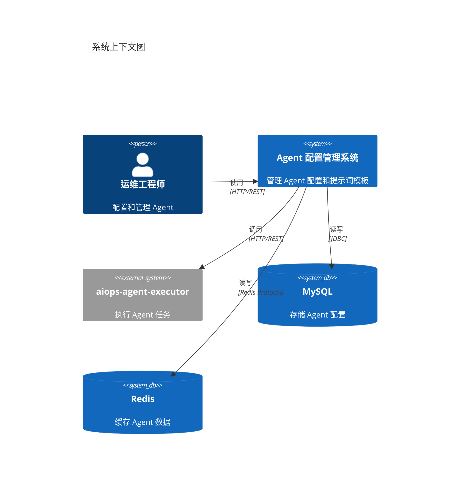
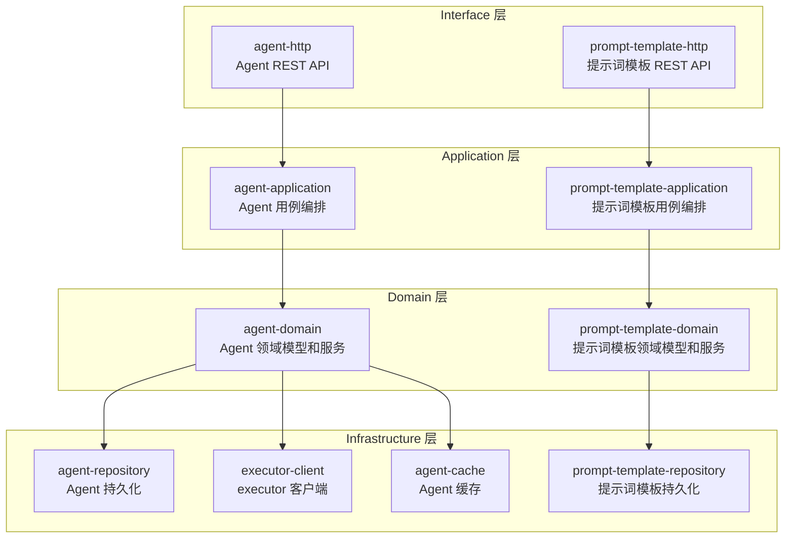
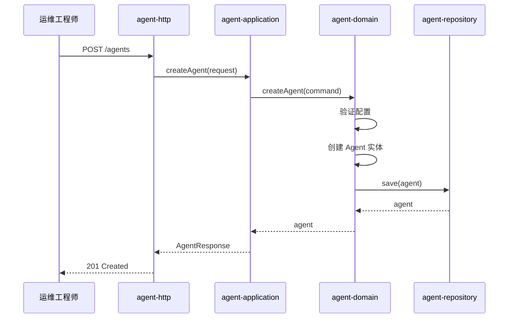
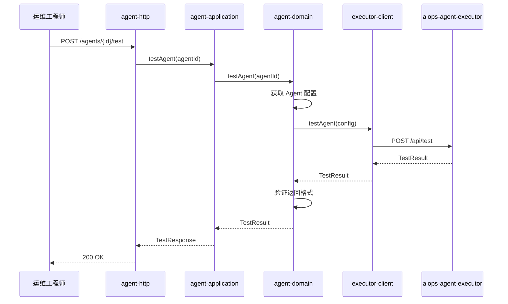
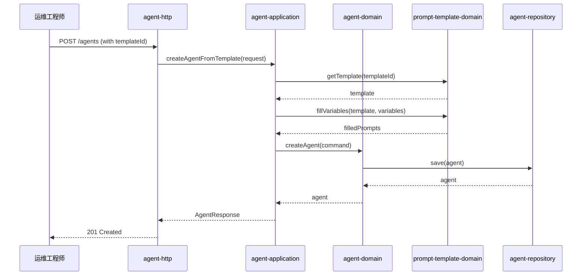
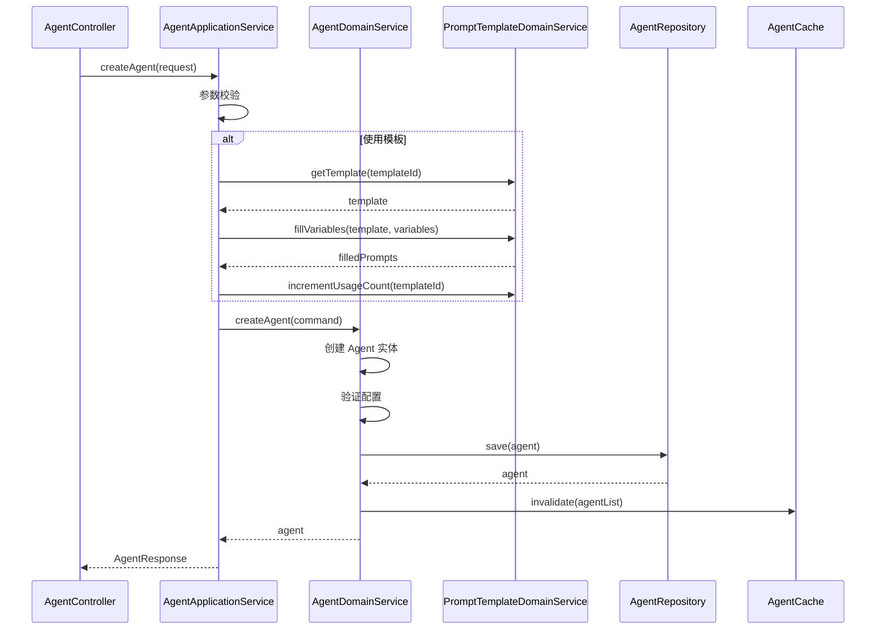
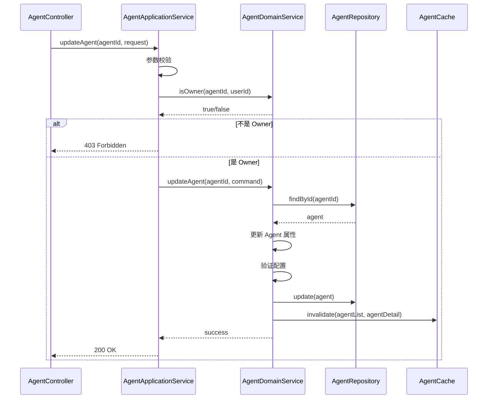
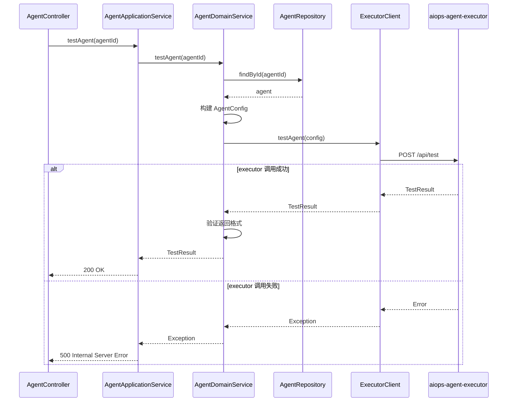
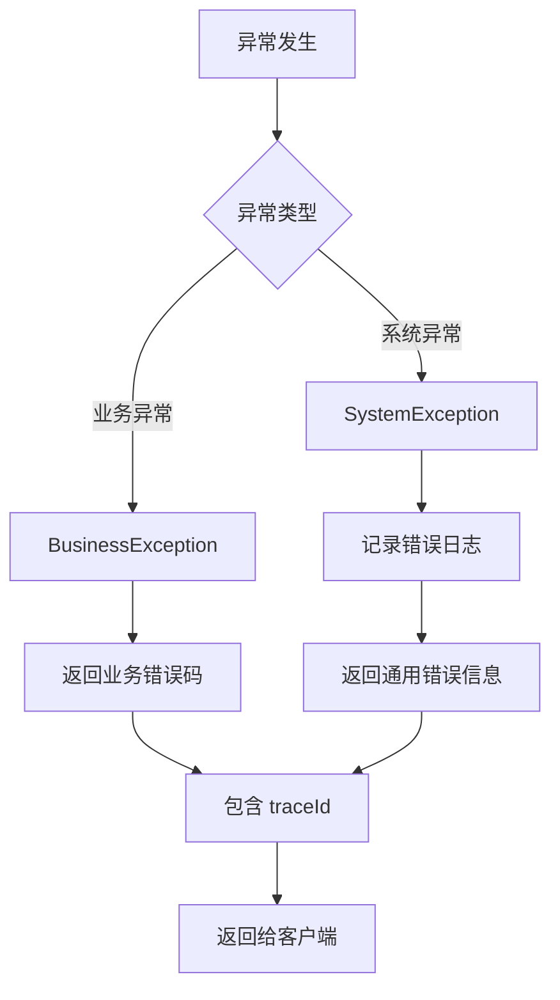

# Agent 配置和管理 - 设计文档

## 1. 概述

### 1.1 设计目标

本文档定义 Agent 配置和管理功能的技术设计方案。该系统负责 Agent 的配置管理和提示词模板管理，实际的 Agent 执行由 aiops-agent-executor 系统负责。

### 1.2 设计范围

**系统内**：
- Agent 配置管理（创建、查看、编辑、删除）
- 提示词模板管理（创建、查看、编辑、删除）
- Agent 测试（调用 executor API 验证配置）
- Agent 类型管理

**系统外**：
- Agent 实际执行（由 aiops-agent-executor 负责）
- 工具管理（由 aiops-agent-executor 提供，当前系统只查询）
- LLM 服务调用（由 aiops-agent-executor 负责）

### 1.3 关键约束

- 采用 DDD 分层架构 + 六边形架构
- 使用 Java 21 + Spring Boot 3.4.1
- 使用 MySQL 8.0+ 和 Redis 7.0+
- 依赖 aiops-agent-executor 系统

## 2. 概要设计

### 2.1 静态结构

#### 2.1.1 系统边界



#### 2.1.2 架构模式选择

**选择**：DDD 分层架构 + 六边形架构

**理由**：
1. 符合项目现有架构规范
2. 清晰的职责边界，便于维护
3. 通过 Port/Adapter 模式隔离外部依赖
4. 支持未来的扩展

**ADR-001：采用 DDD 分层架构**

- **状态**：已接受
- **背景**：需要确定系统架构模式
- **决策**：采用 DDD 分层架构 + 六边形架构
- **理由**：
  - 项目已采用 DDD 架构，保持一致性
  - 清晰的分层职责（Interface → Application → Domain → Infrastructure）
  - 六边形架构隔离外部依赖（executor、数据库）
  - 便于测试和维护
- **后果**：
  - 正面：架构清晰，职责明确，易于扩展
  - 负面：需要严格遵守分层规则，增加一定的代码量


#### 2.1.3 模块划分



**模块清单**：

| 模块 | 层次 | 职责 | 依赖 |
|------|------|------|------|
| agent-http | Interface | Agent REST API | agent-application |
| prompt-template-http | Interface | 提示词模板 REST API | prompt-template-application |
| agent-application | Application | Agent 用例编排、事务控制 | agent-domain |
| prompt-template-application | Application | 提示词模板用例编排 | prompt-template-domain |
| agent-domain | Domain | Agent 领域模型、业务规则 | agent-repository, executor-client, agent-cache |
| prompt-template-domain | Domain | 提示词模板领域模型 | prompt-template-repository |
| agent-repository | Infrastructure | Agent 数据持久化（MySQL） | - |
| prompt-template-repository | Infrastructure | 提示词模板持久化（MySQL） | - |
| executor-client | Infrastructure | aiops-agent-executor 客户端 | - |
| agent-cache | Infrastructure | Agent 缓存（Redis） | - |


#### 2.1.4 技术栈选择

| 技术领域 | 选择 | 版本 | 理由 |
|---------|------|------|------|
| 编程语言 | Java | 21 (LTS) | 项目标准，支持虚拟线程 |
| 应用框架 | Spring Boot | 3.4.1 | 项目标准，成熟稳定 |
| Web 框架 | Spring Web | 6.2.x | Spring Boot 内置 |
| 数据访问 | MyBatis-Plus | 3.5.7 | 项目标准，简化 CRUD |
| 数据库 | MySQL | 8.0+ | 项目标准，关系型数据 |
| 缓存 | Redis | 7.0+ | 项目标准，高性能缓存 |
| HTTP 客户端 | Spring WebClient | 6.2.x | 响应式，支持异步 |
| JSON 处理 | Jackson | 2.17.x | Spring Boot 默认 |
| 参数校验 | Validation | 3.1.x | Spring Boot 内置 |
| 日志 | Logback | 1.5.x | Spring Boot 默认 |

**ADR-002：选择 Spring WebClient 调用 executor**

- **状态**：已接受
- **背景**：需要选择 HTTP 客户端调用 aiops-agent-executor
- **决策**：使用 Spring WebClient
- **理由**：
  - Spring 官方推荐的响应式 HTTP 客户端
  - 支持同步和异步调用
  - 与 Spring Boot 集成良好
  - 性能优于 RestTemplate
- **备选方案**：
  - RestTemplate：已过时，Spring 不推荐
  - OkHttp：需要额外依赖，集成复杂
  - Apache HttpClient：配置复杂
- **后果**：
  - 正面：性能好，集成简单，支持响应式
  - 负面：学习曲线略高于 RestTemplate

#### 2.1.5 模块间接口协议

**HTTP REST API**：
- 协议：HTTP/1.1
- 数据格式：JSON
- 认证：JWT Token（继承现有认证机制）
- API 风格：RESTful

**内部模块通信**：
- Application → Domain：方法调用
- Domain → Infrastructure：接口调用（依赖倒置）

**外部系统通信**：
- 当前系统 → executor：HTTP REST API（JSON）


### 2.2 动态行为

#### 2.2.1 关键业务流程

**流程 1：创建 Agent**



**流程 2：测试 Agent**



**流程 3：使用模板创建 Agent**




### 2.3 辅助设计

#### 2.3.1 性能策略

**缓存策略**：
- **Agent 列表缓存**：使用 Redis 缓存 Agent 列表，TTL 5 分钟
- **工具列表缓存**：缓存从 executor 查询的工具列表，TTL 10 分钟
- **缓存失效**：Agent 创建/更新/删除时清除相关缓存

**查询优化**：
- Agent 列表查询使用分页（默认 20 条/页）
- 添加数据库索引：agent_type, owner_id, created_at

**性能指标**：
- Agent 列表查询 < 500ms（P95）
- Agent 创建/更新/删除 < 200ms（P95）

#### 2.3.2 安全策略

**认证**：
- 继承现有的 JWT Token 认证机制
- Token 有效期 2 小时

**授权**：
- Agent Owner 权限检查：只有 Owner 可编辑/删除
- 所有用户可查看所有 Agent
- 所有用户可测试 Agent

**数据保护**：
- 敏感配置（如 API Key）加密存储
- HTTPS 传输加密

#### 2.3.3 可观测性策略

**日志记录**：
- 记录所有 API 请求和响应（包含 traceId）
- 记录 executor 调用的请求和响应
- 记录 Agent 配置变更（审计日志）

**监控指标**：
- API 响应时间（P50、P95、P99）
- API 错误率
- executor 调用成功率和响应时间
- 数据库连接池使用率

**链路追踪**：
- 使用 Micrometer Tracing 生成 traceId
- 日志自动包含 traceId

#### 2.3.4 错误处理

**错误分类**：
- **业务错误**：参数校验失败、权限不足、资源不存在
- **系统错误**：数据库连接失败、executor 调用失败

**错误响应格式**：
```json
{
  "code": "AGENT_NOT_FOUND",
  "message": "Agent not found",
  "traceId": "abc123",
  "timestamp": "2024-12-06T10:00:00Z"
}
```

**重试策略**：
- executor 调用失败：不重试（由 executor 内部处理）
- 数据库操作失败：不重试（事务回滚）


## 3. 详细设计

### 3.1 静态结构

#### 3.1.1 接口定义

**Agent REST API（OpenAPI 规范）**

```yaml
openapi: 3.0.0
info:
  title: Agent Management API
  version: 1.0.0
  description: Agent 配置管理 API

paths:
  /api/agents:
    get:
      summary: 查询 Agent 列表
      operationId: listAgents
      parameters:
        - name: type
          in: query
          schema:
            type: string
          description: Agent 类型过滤
        - name: keyword
          in: query
          schema:
            type: string
          description: 搜索关键词
        - name: page
          in: query
          schema:
            type: integer
            default: 1
        - name: pageSize
          in: query
          schema:
            type: integer
            default: 20
      responses:
        '200':
          description: 查询成功
          content:
            application/json:
              schema:
                $ref: '#/components/schemas/AgentListResponse'

    post:
      summary: 创建 Agent
      operationId: createAgent
      requestBody:
        required: true
        content:
          application/json:
            schema:
              $ref: '#/components/schemas/CreateAgentRequest'
      responses:
        '201':
          description: 创建成功
          content:
            application/json:
              schema:
                $ref: '#/components/schemas/AgentResponse'
        '400':
          description: 参数校验失败
        '422':
          description: 业务规则校验失败

  /api/agents/{agentId}:
    get:
      summary: 查询 Agent 详情
      operationId: getAgent
      parameters:
        - name: agentId
          in: path
          required: true
          schema:
            type: string
      responses:
        '200':
          description: 查询成功
          content:
            application/json:
              schema:
                $ref: '#/components/schemas/AgentDetailResponse'
        '404':
          description: Agent 不存在

    put:
      summary: 更新 Agent
      operationId: updateAgent
      parameters:
        - name: agentId
          in: path
          required: true
          schema:
            type: string
      requestBody:
        required: true
        content:
          application/json:
            schema:
              $ref: '#/components/schemas/UpdateAgentRequest'
      responses:
        '200':
          description: 更新成功
        '403':
          description: 权限不足
        '404':
          description: Agent 不存在

    delete:
      summary: 删除 Agent
      operationId: deleteAgent
      parameters:
        - name: agentId
          in: path
          required: true
          schema:
            type: string
      responses:
        '204':
          description: 删除成功
        '403':
          description: 权限不足
        '404':
          description: Agent 不存在

  /api/agents/{agentId}/test:
    post:
      summary: 测试 Agent
      operationId: testAgent
      parameters:
        - name: agentId
          in: path
          required: true
          schema:
            type: string
      responses:
        '200':
          description: 测试成功
          content:
            application/json:
              schema:
                $ref: '#/components/schemas/TestAgentResponse'
        '404':
          description: Agent 不存在
        '500':
          description: executor 调用失败

components:
  schemas:
    CreateAgentRequest:
      type: object
      required: [name, type, description]
      properties:
        name:
          type: string
          minLength: 1
          maxLength: 100
        type:
          type: string
          enum: [INSPECTION, FAULT_ANALYSIS]
        description:
          type: string
          maxLength: 500
        systemPrompt:
          type: string
        userPrompt:
          type: string
        templateId:
          type: string
          description: 提示词模板 ID（可选）
        templateVariables:
          type: object
          description: 模板变量值
        toolIds:
          type: array
          items:
            type: string
        executionConfig:
          $ref: '#/components/schemas/ExecutionConfig'
        outputConfig:
          $ref: '#/components/schemas/OutputConfig'

    ExecutionConfig:
      type: object
      properties:
        timeoutSeconds:
          type: integer
          minimum: 1
          default: 600
        retryCount:
          type: integer
          minimum: 0
          maximum: 5
          default: 3

    OutputConfig:
      type: object
      properties:
        reportFormat:
          type: string
          enum: [MARKDOWN, HTML]
          default: MARKDOWN
        notificationChannels:
          type: array
          items:
            type: string
            enum: [IN_APP, EMAIL]

    AgentResponse:
      type: object
      properties:
        id:
          type: string
        name:
          type: string
        type:
          type: string
        description:
          type: string
        ownerId:
          type: string
        createdAt:
          type: string
          format: date-time
        updatedAt:
          type: string
          format: date-time

    AgentListResponse:
      type: object
      properties:
        items:
          type: array
          items:
            $ref: '#/components/schemas/AgentResponse'
        total:
          type: integer
        page:
          type: integer
        pageSize:
          type: integer

    AgentDetailResponse:
      allOf:
        - $ref: '#/components/schemas/AgentResponse'
        - type: object
          properties:
            systemPrompt:
              type: string
            userPrompt:
              type: string
            toolIds:
              type: array
              items:
                type: string
            executionConfig:
              $ref: '#/components/schemas/ExecutionConfig'
            outputConfig:
              $ref: '#/components/schemas/OutputConfig'

    TestAgentResponse:
      type: object
      properties:
        success:
          type: boolean
        message:
          type: string
        executorResponse:
          type: object
          description: executor 返回的原始响应
```


**提示词模板 REST API（OpenAPI 规范）**

```yaml
paths:
  /api/prompt-templates:
    get:
      summary: 查询提示词模板列表
      operationId: listPromptTemplates
      parameters:
        - name: category
          in: query
          schema:
            type: string
        - name: keyword
          in: query
          schema:
            type: string
      responses:
        '200':
          description: 查询成功
          content:
            application/json:
              schema:
                type: array
                items:
                  $ref: '#/components/schemas/PromptTemplateResponse'

    post:
      summary: 创建提示词模板
      operationId: createPromptTemplate
      requestBody:
        required: true
        content:
          application/json:
            schema:
              $ref: '#/components/schemas/CreatePromptTemplateRequest'
      responses:
        '201':
          description: 创建成功

  /api/prompt-templates/{templateId}:
    get:
      summary: 查询模板详情
      operationId: getPromptTemplate
      parameters:
        - name: templateId
          in: path
          required: true
          schema:
            type: string
      responses:
        '200':
          description: 查询成功
          content:
            application/json:
              schema:
                $ref: '#/components/schemas/PromptTemplateDetailResponse'

components:
  schemas:
    CreatePromptTemplateRequest:
      type: object
      required: [name, category, systemPrompt, userPrompt]
      properties:
        name:
          type: string
        category:
          type: string
        description:
          type: string
        systemPrompt:
          type: string
        userPrompt:
          type: string
        variables:
          type: array
          items:
            $ref: '#/components/schemas/TemplateVariable'

    TemplateVariable:
      type: object
      required: [name, type]
      properties:
        name:
          type: string
        type:
          type: string
          enum: [STRING, NUMBER, BOOLEAN, ENUM]
        required:
          type: boolean
        defaultValue:
          type: string
        description:
          type: string
        enumValues:
          type: array
          items:
            type: string

    PromptTemplateResponse:
      type: object
      properties:
        id:
          type: string
        name:
          type: string
        category:
          type: string
        description:
          type: string
        usageCount:
          type: integer
        createdAt:
          type: string
          format: date-time

    PromptTemplateDetailResponse:
      allOf:
        - $ref: '#/components/schemas/PromptTemplateResponse'
        - type: object
          properties:
            systemPrompt:
              type: string
            userPrompt:
              type: string
            variables:
              type: array
              items:
                $ref: '#/components/schemas/TemplateVariable'
```


#### 3.1.2 数据结构设计

**实体属性表**

| 实体 | 属性 | 类型 | 必填 | 说明 | 约束 |
|------|------|------|------|------|------|
| Agent | id | String | 是 | Agent ID | UUID |
| Agent | name | String | 是 | Agent 名称 | 1-100 字符 |
| Agent | type | AgentType | 是 | Agent 类型 | 枚举值 |
| Agent | description | String | 是 | Agent 描述 | 最多 500 字符 |
| Agent | systemPrompt | String | 否 | 系统提示词 | |
| Agent | userPrompt | String | 否 | 用户提示词 | |
| Agent | toolIds | List<String> | 否 | 工具 ID 列表 | JSON 数组 |
| Agent | executionConfig | ExecutionConfig | 是 | 执行参数配置 | JSON 对象 |
| Agent | outputConfig | OutputConfig | 是 | 输出配置 | JSON 对象 |
| Agent | ownerId | String | 是 | 所有者 ID | |
| Agent | createdAt | DateTime | 是 | 创建时间 | ISO8601 |
| Agent | updatedAt | DateTime | 是 | 更新时间 | ISO8601 |
| Agent | deleted | Boolean | 是 | 是否删除 | 默认 false |
| ExecutionConfig | timeoutSeconds | Integer | 是 | 超时时间（秒） | 默认 600 |
| ExecutionConfig | retryCount | Integer | 是 | 重试次数 | 0-5，默认 3 |
| OutputConfig | reportFormat | ReportFormat | 是 | 报告格式 | 枚举值 |
| OutputConfig | notificationChannels | List<String> | 否 | 通知渠道 | JSON 数组 |
| PromptTemplate | id | String | 是 | 模板 ID | UUID |
| PromptTemplate | name | String | 是 | 模板名称 | 1-100 字符 |
| PromptTemplate | category | String | 是 | 模板类别 | |
| PromptTemplate | description | String | 否 | 模板描述 | 最多 500 字符 |
| PromptTemplate | systemPrompt | String | 是 | 系统提示词模板 | |
| PromptTemplate | userPrompt | String | 是 | 用户提示词模板 | |
| PromptTemplate | variables | List<TemplateVariable> | 否 | 模板变量 | JSON 数组 |
| PromptTemplate | usageCount | Integer | 是 | 使用次数 | 默认 0 |
| PromptTemplate | ownerId | String | 是 | 所有者 ID | |
| PromptTemplate | createdAt | DateTime | 是 | 创建时间 | ISO8601 |
| PromptTemplate | updatedAt | DateTime | 是 | 更新时间 | ISO8601 |
| PromptTemplate | deleted | Boolean | 是 | 是否删除 | 默认 false |
| TemplateVariable | name | String | 是 | 变量名 | |
| TemplateVariable | type | VariableType | 是 | 变量类型 | 枚举值 |
| TemplateVariable | required | Boolean | 是 | 是否必填 | 默认 false |
| TemplateVariable | defaultValue | String | 否 | 默认值 | |
| TemplateVariable | description | String | 否 | 变量说明 | |
| TemplateVariable | enumValues | List<String> | 否 | 枚举值列表 | 仅当 type=ENUM |

**枚举定义表**

| 枚举类型 | 值 | 说明 |
|---------|-----|------|
| AgentType | INSPECTION | 巡检 Agent |
| AgentType | FAULT_ANALYSIS | 故障分析 Agent |
| ReportFormat | MARKDOWN | Markdown 格式 |
| ReportFormat | HTML | HTML 格式 |
| VariableType | STRING | 字符串类型 |
| VariableType | NUMBER | 数字类型 |
| VariableType | BOOLEAN | 布尔类型 |
| VariableType | ENUM | 枚举类型 |

**实体关系表**

| 实体A | 关系 | 实体B | 多重性 | 说明 |
|-------|------|-------|--------|------|
| Agent | created by | User | N:1 | Agent 属于创建者 |
| Agent | uses | PromptTemplate | N:0..1 | Agent 可以使用模板创建 |
| Agent | references | Tool | N:N | Agent 引用工具（工具在 executor 中） |
| PromptTemplate | created by | User | N:1 | 模板属于创建者 |


#### 3.1.3 核心方法定义

**Agent Domain Service**

```java
public interface AgentDomainService {
    /**
     * 创建 Agent
     * @param command 创建命令
     * @return Agent ID
     */
    AgentId createAgent(CreateAgentCommand command);

    /**
     * 更新 Agent
     * @param agentId Agent ID
     * @param command 更新命令
     */
    void updateAgent(AgentId agentId, UpdateAgentCommand command);

    /**
     * 删除 Agent
     * @param agentId Agent ID
     * @param userId 用户 ID
     */
    void deleteAgent(AgentId agentId, UserId userId);

    /**
     * 测试 Agent
     * @param agentId Agent ID
     * @return 测试结果
     */
    TestResult testAgent(AgentId agentId);

    /**
     * 检查用户是否为 Agent Owner
     * @param agentId Agent ID
     * @param userId 用户 ID
     * @return 是否为 Owner
     */
    boolean isOwner(AgentId agentId, UserId userId);
}
```

**Prompt Template Domain Service**

```java
public interface PromptTemplateDomainService {
    /**
     * 创建提示词模板
     * @param command 创建命令
     * @return 模板 ID
     */
    TemplateId createTemplate(CreateTemplateCommand command);

    /**
     * 填充模板变量
     * @param templateId 模板 ID
     * @param variables 变量值
     * @return 填充后的提示词
     */
    FilledPrompts fillVariables(TemplateId templateId, Map<String, Object> variables);

    /**
     * 增加模板使用次数
     * @param templateId 模板 ID
     */
    void incrementUsageCount(TemplateId templateId);
}
```

**Executor Client Interface**

```java
public interface ExecutorClient {
    /**
     * 测试 Agent 配置
     * @param config Agent 配置
     * @return 测试结果
     */
    TestResult testAgent(AgentConfig config);

    /**
     * 查询可用工具列表
     * @return 工具列表
     */
    List<Tool> listTools();
}
```

### 3.2 动态行为

#### 3.2.1 详细业务流程

**流程 1：创建 Agent（详细）**



**流程 2：更新 Agent（详细）**



**流程 3：测试 Agent（详细）**




#### 3.2.2 实体状态变化

**Agent 状态转换**

Agent 本身没有复杂的状态机，只有简单的生命周期状态：

| 当前状态 | 触发事件 | 目标状态 | 说明 |
|---------|---------|---------|------|
| - | create() | 已创建 | Agent 创建成功 |
| 已创建 | update() | 已创建 | Agent 配置更新 |
| 已创建 | delete() | 已删除 | Agent 逻辑删除 |

**注意**：Agent 的执行状态（运行中、已完成等）由 aiops-agent-executor 管理，不在当前系统范围内。

### 3.3 辅助设计

#### 3.3.1 详细的性能设计

**缓存设计**：

| 缓存键 | 缓存内容 | TTL | 失效策略 |
|-------|---------|-----|---------|
| `agent:list:{type}:{page}` | Agent 列表 | 5 分钟 | Agent 创建/更新/删除时清除 |
| `agent:detail:{id}` | Agent 详情 | 10 分钟 | Agent 更新/删除时清除 |
| `tools:list` | 工具列表 | 10 分钟 | 定时刷新 |
| `template:list:{category}` | 模板列表 | 10 分钟 | 模板创建/更新/删除时清除 |

**数据库索引**：

| 表 | 索引字段 | 类型 | 说明 |
|-----|---------|------|------|
| agent | (type, deleted, created_at) | 复合索引 | 支持按类型查询和排序 |
| agent | (owner_id, deleted) | 复合索引 | 支持按所有者查询 |
| agent | (name) | 普通索引 | 支持按名称搜索 |
| prompt_template | (category, deleted) | 复合索引 | 支持按类别查询 |
| prompt_template | (owner_id, deleted) | 复合索引 | 支持按所有者查询 |

**分页策略**：
- 默认每页 20 条
- 最大每页 100 条
- 使用 LIMIT/OFFSET 分页

#### 3.3.2 详细的安全设计

**权限检查点**：

| 操作 | 权限要求 | 检查逻辑 |
|------|---------|---------|
| 创建 Agent | 已登录 | 检查 JWT Token |
| 查看 Agent 列表 | 已登录 | 检查 JWT Token |
| 查看 Agent 详情 | 已登录 | 检查 JWT Token |
| 更新 Agent | Agent Owner | 检查 ownerId == userId |
| 删除 Agent | Agent Owner | 检查 ownerId == userId |
| 测试 Agent | 已登录 | 检查 JWT Token |

**数据加密**：
- 敏感配置字段（如 API Key）使用 AES-256 加密存储
- 加密密钥从配置中心获取，不硬编码

**审计日志**：
记录以下操作：
- Agent 创建/更新/删除
- 提示词模板创建/更新/删除
- Agent 测试操作

审计日志格式：
```json
{
  "timestamp": "2024-12-06T10:00:00Z",
  "userId": "user123",
  "action": "CREATE_AGENT",
  "resourceId": "agent456",
  "details": {
    "agentName": "巡检 Agent",
    "agentType": "INSPECTION"
  },
  "traceId": "abc123"
}
```

#### 3.3.3 详细的错误处理

**错误码定义**：

| 错误码 | HTTP 状态码 | 说明 | 处理方式 |
|-------|------------|------|---------|
| AGENT_NOT_FOUND | 404 | Agent 不存在 | 返回错误信息 |
| AGENT_NAME_DUPLICATE | 422 | Agent 名称重复 | 返回错误信息 |
| PERMISSION_DENIED | 403 | 权限不足 | 返回错误信息 |
| INVALID_PARAMETER | 400 | 参数校验失败 | 返回校验错误详情 |
| TEMPLATE_NOT_FOUND | 404 | 模板不存在 | 返回错误信息 |
| TEMPLATE_VARIABLE_MISSING | 422 | 模板变量缺失 | 返回缺失的变量列表 |
| EXECUTOR_CALL_FAILED | 500 | executor 调用失败 | 记录日志，返回通用错误 |
| DATABASE_ERROR | 500 | 数据库错误 | 记录日志，返回通用错误 |

**异常处理流程**：



**降级策略**：
- executor 调用失败：返回错误，不降级（测试功能不是核心功能）
- 缓存失败：直接查询数据库
- 数据库查询超时：返回错误，记录告警


## 4. 技术决策记录（ADR）

### ADR-001：采用 DDD 分层架构

- **状态**：已接受
- **背景**：需要确定系统架构模式
- **决策**：采用 DDD 分层架构 + 六边形架构
- **理由**：
  - 项目已采用 DDD 架构，保持一致性
  - 清晰的分层职责（Interface → Application → Domain → Infrastructure）
  - 六边形架构隔离外部依赖（executor、数据库）
  - 便于测试和维护
- **后果**：
  - 正面：架构清晰，职责明确，易于扩展
  - 负面：需要严格遵守分层规则，增加一定的代码量

### ADR-002：选择 Spring WebClient 调用 executor

- **状态**：已接受
- **背景**：需要选择 HTTP 客户端调用 aiops-agent-executor
- **决策**：使用 Spring WebClient
- **理由**：
  - Spring 官方推荐的响应式 HTTP 客户端
  - 支持同步和异步调用
  - 与 Spring Boot 集成良好
  - 性能优于 RestTemplate
- **备选方案**：
  - RestTemplate：已过时，Spring 不推荐
  - OkHttp：需要额外依赖，集成复杂
  - Apache HttpClient：配置复杂
- **后果**：
  - 正面：性能好，集成简单，支持响应式
  - 负面：学习曲线略高于 RestTemplate

### ADR-003：Agent 配置使用 JSON 存储

- **状态**：已接受
- **背景**：Agent 的执行参数、输出配置等是复杂对象，需要选择存储方式
- **决策**：使用 JSON 格式存储在 MySQL 的 TEXT 字段中
- **理由**：
  - MySQL 8.0+ 支持 JSON 类型和查询
  - 配置结构灵活，易于扩展
  - 避免创建过多的关联表
  - MyBatis-Plus 支持 JSON 类型映射
- **备选方案**：
  - 关系表：需要创建多个表，结构复杂
  - 序列化为字符串：不支持查询，不易维护
- **后果**：
  - 正面：灵活，易于扩展，支持查询
  - 负面：JSON 字段不易建立索引

### ADR-004：提示词模板变量使用 {{变量名}} 语法

- **状态**：已接受
- **背景**：需要定义提示词模板的变量语法
- **决策**：使用 Mustache 风格的 {{变量名}} 语法
- **理由**：
  - 简单直观，易于理解
  - 与主流模板引擎（Mustache、Handlebars）一致
  - 不与 Markdown 语法冲突
  - 易于正则匹配和替换
- **备选方案**：
  - ${变量名}：与 Spring EL 冲突
  - {变量名}：与 JSON 语法冲突
  - [[变量名]]：不够直观
- **后果**：
  - 正面：简单易用，兼容性好
  - 负面：需要转义 {{ 字符

### ADR-005：Agent 测试只验证返回格式

- **状态**：已接受
- **背景**：Agent 测试功能的范围需要明确
- **决策**：测试 Agent 时只调用 executor API，验证返回格式一致即可，不检查内容
- **理由**：
  - 当前系统只负责配置管理，不负责执行
  - 实际的 Agent 执行由 executor 负责
  - 测试的目的是验证配置能被 executor 接受
  - 避免当前系统与 executor 的强耦合
- **后果**：
  - 正面：职责清晰，系统解耦
  - 负面：无法验证 Agent 的实际执行效果

## 5. 风险和应对

### 5.1 技术风险

| 风险ID | 风险描述 | 影响程度 | 概率 | 应对策略 |
|-------|---------|---------|------|---------|
| RISK-001 | executor 服务不可用 | 高 | 中 | 1. 测试功能降级，返回友好提示<br>2. 添加健康检查<br>3. 设置合理的超时时间 |
| RISK-002 | executor API 变更 | 中 | 中 | 1. 定义清晰的接口契约<br>2. 使用版本化 API<br>3. 添加集成测试 |
| RISK-003 | 数据库性能瓶颈 | 中 | 低 | 1. 添加合适的索引<br>2. 使用 Redis 缓存<br>3. 分页查询 |
| RISK-004 | JSON 字段查询性能 | 低 | 中 | 1. 避免复杂的 JSON 查询<br>2. 将常用查询字段提取为独立列<br>3. 使用缓存 |

### 5.2 依赖风险

| 依赖 | 风险 | 应对策略 |
|------|------|---------|
| aiops-agent-executor | 服务不可用或 API 变更 | 1. 定义清晰的接口契约<br>2. 添加健康检查<br>3. 测试功能降级 |
| MySQL | 数据库故障 | 1. 主从复制<br>2. 定期备份<br>3. 监控告警 |
| Redis | 缓存服务故障 | 1. 降级到直接查询数据库<br>2. Redis 集群部署 |

### 5.3 性能风险

| 风险 | 应对策略 |
|------|---------|
| Agent 列表查询慢 | 1. 添加数据库索引<br>2. 使用 Redis 缓存<br>3. 分页查询 |
| executor 调用超时 | 1. 设置合理的超时时间（30 秒）<br>2. 异步调用（可选）<br>3. 添加重试机制（可选） |
| 并发创建 Agent | 1. 数据库连接池配置<br>2. 限流（可选） |

### 5.4 安全风险

| 风险 | 应对策略 |
|------|---------|
| 未授权访问 | 1. JWT Token 认证<br>2. Owner 权限检查<br>3. API 访问日志 |
| 敏感信息泄露 | 1. 敏感字段加密存储<br>2. HTTPS 传输<br>3. 日志脱敏 |
| SQL 注入 | 1. 使用 MyBatis 参数化查询<br>2. 输入参数校验 |

## 6. 实施计划

### 6.1 开发顺序

1. **基础设施**：数据库表、Repository、Cache
2. **Domain 层**：Agent 和 PromptTemplate 领域模型和服务
3. **Application 层**：用例编排
4. **Infrastructure 层**：executor-client 实现
5. **Interface 层**：REST API
6. **测试**：单元测试、集成测试

### 6.2 里程碑

| 里程碑 | 交付内容 | 预计时间 |
|-------|---------|---------|
| M1 | 数据库设计和基础设施 | 2 天 |
| M2 | Agent 管理功能（CRUD） | 3 天 |
| M3 | 提示词模板管理功能 | 2 天 |
| M4 | Agent 测试功能 | 2 天 |
| M5 | 集成测试和文档 | 1 天 |

**总计**：10 天

---

**文档版本**：v1.0  
**创建日期**：2024-12-06  
**最后更新**：2024-12-06
