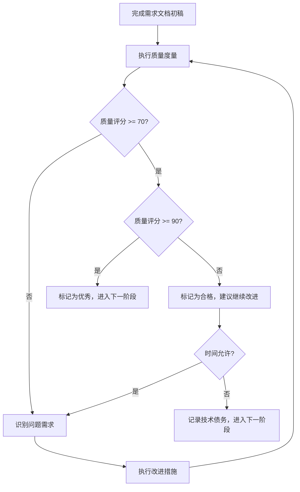

# 需求分析阶段最佳实践

## 阶段目标

将用户的原始想法转化为结构化、可验证的需求文档，为后续设计和实现奠定坚实基础。

## 为什么需求阶段如此重要

需求是整个开发流程的起点，需求的质量直接决定了最终交付物的质量。需求阶段的错误会在后续阶段被放大，修复成本呈指数级增长。

**关键原则**：切勿一次性完成所有阶段。LLM 是概率模型，需要通过多次自检和双向验证来确保质量。

## 需求分析工作流程

### 第一步：准备原始需求文档

在创建 Spec 之前，先准备详细的原始需求文档。

**为什么需要原始文档**：
- 提供完整的上下文信息
- 作为需求验证的基准
- 避免信息在口头传达中丢失

**原始文档应包含**：
- 项目背景和目标
- 核心功能描述
- 技术约束和限制
- 非功能性需求（性能、安全等）
- 关键的业务规则


### 第二步：创建结构化需求文档

基于原始需求文档，创建符合 EARS 语法的结构化需求文档。

**需求文档结构**：
- **引言**：项目概述和背景
- **术语表**：定义关键术语和概念
- **需求列表**：用户故事 + 验收标准

**EARS 语法要求**：
- 使用标准的 EARS 模式（THE、SHALL、WHEN、WHILE、IF、THEN、WHERE）
- 每个需求必须清晰、可测试、可验证
- 避免模糊词汇（"快速"、"适当"等）

### 第三步：需求完整性验证

**关键**：需求创建完成后，不要立即进入设计阶段，而是进行充分的自检和验证。

**验证维度**：

#### 1. 一致性验证
- [ ] 需求是否与原始意图一致？
- [ ] 需求之间是否存在冲突？
- [ ] 术语使用是否一致？

#### 2. 完整性验证
- [ ] 是否完全覆盖了原始意图？
- [ ] 是否遗漏了关键的功能需求？
- [ ] 是否遗漏了非功能性需求（性能、安全、可维护性等）？

#### 3. 准确性验证
- [ ] 对原始需求的理解是否准确？
- [ ] 是否存在模糊或歧义的表述？
- [ ] 验收标准是否具体、可测试？

#### 4. 必要性验证
- [ ] 是否有需要澄清的内容？
- [ ] 是否有需要用户补充的信息？
- [ ] 是否有过度解读或过度设计的倾向？

**验证方法**：

使用以下提示词让 Kiro 进行自检：

> "请检查需求是否与原始意图一致，任何需要澄清的需求点，请务必与我确认，确保需求足够完备，足够准确。"

### 第四步：用户确认

与用户确认需求文档，确保理解一致。

**必须确认的内容**：
- 原始需求文档中提到的需要补充的信息
- 存在歧义或多种理解的需求点
- 非功能性需求的具体指标
- 技术选型和约束条件

**只有在用户明确确认后，才能进入设计阶段。**

## 实用模板

### 原始需求文档模板

使用以下模板准备原始需求文档：

```markdown
# [项目名称] - 原始需求文档

## 1. 项目背景
- **业务目标**：[描述为什么要做这个项目]
- **当前问题**：[描述现有系统/流程的痛点]
- **预期收益**：[项目成功后的价值]

## 2. 核心功能需求
### 功能点 1：[功能名称]
- **描述**：[功能的详细描述]
- **使用场景**：[何时使用、谁使用、为什么使用]
- **期望行为**：[系统应该如何响应]

### 功能点 2：[功能名称]
...

## 3. 用户角色
| 角色名称 | 职责描述 | 主要需求 |
|---------|---------|---------|
| 管理员   | ...     | ...     |
| 普通用户 | ...     | ...     |

## 4. 非功能性需求
- **性能要求**：[响应时间、并发量、吞吐量等]
- **安全要求**：[认证、授权、数据加密等]
- **可用性要求**：[可用性百分比、故障恢复时间等]
- **可维护性要求**：[日志、监控、可扩展性等]
- **兼容性要求**：[浏览器、设备、操作系统等]

## 5. 技术约束
- **技术栈限制**：[必须使用或不能使用的技术]
- **集成要求**：[需要集成的第三方系统]
- **环境约束**：[部署环境、网络限制等]

## 6. 业务规则
- **规则 1**：[描述业务逻辑规则]
- **规则 2**：...

## 7. 数据需求
- **输入数据**：[系统需要接收哪些数据]
- **输出数据**：[系统需要产生哪些数据]
- **数据迁移**：[是否需要从旧系统迁移数据]

## 8. 界面需求（如适用）
- **界面风格**：[UI/UX 要求]
- **交互方式**：[用户如何与系统交互]
- **参考设计**：[附加线框图或参考截图]

## 9. 待澄清问题
- [ ] [问题 1]
- [ ] [问题 2]

## 10. 成功标准
- [如何判断项目是否成功]
```

### 结构化需求文档模板

使用以下模板创建 EARS 格式的需求文档：

```markdown
# [项目名称] - 需求规格说明书

**文档版本**：v1.0.0
**创建日期**：YYYY-MM-DD
**最后更新**：YYYY-MM-DD
**状态**：草稿 / 审核中 / 已批准

---

## 1. 引言

### 1.1 项目概述
[简要描述项目背景、目标和范围]

### 1.2 文档目的
本文档定义了 [项目名称] 的功能和非功能需求，作为设计、开发和测试的基准。

### 1.3 读者对象
- 产品经理
- 开发团队
- 测试团队
- 项目干系人

### 1.4 参考资料
- [原始需求文档路径]
- [相关技术文档]

---

## 2. 术语表

| 术语 | 定义 | 备注 |
|-----|------|-----|
| [术语1] | [明确的定义] | [补充说明] |
| [术语2] | [明确的定义] | [补充说明] |

---

## 3. 用户角色

| 角色ID | 角色名称 | 职责描述 | 权限级别 |
|-------|---------|---------|---------|
| ROLE-001 | [角色名] | [职责] | [权限] |

---

## 4. 功能需求

### 4.1 用户故事 1：[故事标题]

**需求ID**：REQ-001
**优先级**：Must Have / Should Have / Could Have
**相关角色**：ROLE-001

**用户故事**：
> 作为 [角色]，我想要 [功能]，以便 [业务价值]。

**验收标准**：
1. **WHEN** [触发条件] **THEN** THE System **SHALL** [系统响应]
2. **IF** [条件] **THEN** THE System **SHALL** [行为]
3. THE System **SHALL** [无条件行为]

**补充说明**：
- [任何需要额外说明的内容]

---

### 4.2 用户故事 2：[故事标题]
...

---

## 5. 非功能需求

### 5.1 性能需求
- **REQ-NFR-001**: THE System **SHALL** 在 [X] 秒内响应 [Y]% 的用户请求
- **REQ-NFR-002**: THE System **SHALL** 支持至少 [N] 个并发用户

### 5.2 安全需求
- **REQ-NFR-003**: THE System **SHALL** 使用 HTTPS 加密所有网络通信
- **REQ-NFR-004**: **WHEN** 用户连续 3 次登录失败 **THEN** THE System **SHALL** 锁定账户 15 分钟

### 5.3 可用性需求
- **REQ-NFR-005**: THE System **SHALL** 达到 99.9% 的月度可用性

### 5.4 可维护性需求
- **REQ-NFR-006**: THE System **SHALL** 记录所有错误信息到日志系统

### 5.5 兼容性需求
- **REQ-NFR-007**: THE System **SHALL** 支持 Chrome、Firefox、Safari 最新两个版本

---

## 6. 约束条件

### 6.1 技术约束
- [技术栈限制]

### 6.2 业务约束
- [业务规则限制]

### 6.3 法规约束
- [合规要求]

---

## 7. 假设与依赖

### 7.1 假设
- [假设条件 1]
- [假设条件 2]

### 7.2 外部依赖
- [依赖的外部系统/服务]

---

## 8. 风险识别

| 风险ID | 风险描述 | 影响程度 | 应对策略 |
|-------|---------|---------|---------|
| RISK-001 | [风险] | 高/中/低 | [应对措施] |

---

## 9. 需求追溯矩阵

| 需求ID | 原始需求来源 | 设计文档 | 测试用例 |
|-------|------------|---------|---------|
| REQ-001 | [来源章节] | [TBD] | [TBD] |

---

## 10. 版本历史

| 版本 | 日期 | 修改内容 | 作者 |
|-----|------|---------|------|
| v1.0.0 | YYYY-MM-DD | 初始版本 | [姓名] |
```

### 验证提示词库

根据不同的验证维度，使用以下提示词让 Kiro 进行深度检查：

#### 完整性验证提示词

```
请对需求文档进行完整性检查，重点关注：

1. **功能覆盖度**：
   - 对比原始需求文档，检查是否遗漏任何功能点
   - 列出原始需求中的每个功能，标注是否已在需求文档中体现

2. **场景覆盖度**：
   - 检查是否覆盖了正常场景、异常场景、边界场景
   - 对每个功能，思考"如果...会怎样"的场景

3. **角色覆盖度**：
   - 检查是否为每个用户角色都定义了相应的需求
   - 是否遗漏了某些角色的特殊需求

4. **非功能性需求**：
   - 是否明确了性能、安全、可用性、可维护性要求
   - 是否有具体的量化指标

请列出发现的遗漏项，并说明这些遗漏可能造成的影响。
```

#### 一致性验证提示词

```
请对需求文档进行一致性检查，重点关注：

1. **需求间一致性**：
   - 检查需求之间是否存在矛盾或冲突
   - 特别关注不同功能模块之间的交互

2. **术语一致性**：
   - 检查同一概念在不同地方的表述是否一致
   - 检查术语表中的定义是否在需求中被正确使用

3. **与原始需求的一致性**：
   - 对比原始需求文档，检查理解是否准确
   - 是否有对原始需求的曲解或过度解读

4. **验收标准与需求的一致性**：
   - 验收标准是否真正验证了需求的核心价值
   - 是否有验收标准覆盖不到的需求点

请列出发现的不一致之处，并提供修正建议。
```

#### 准确性验证提示词

```
请对需求文档进行准确性检查，重点关注：

1. **语义清晰度**：
   - 检查是否存在模糊、歧义的表述
   - 列出所有模糊词汇（如"快速"、"适当"、"尽可能"）

2. **EARS 语法规范**：
   - 检查每个需求是否符合 EARS 语法
   - 检查条件、触发、响应是否明确

3. **可测试性**：
   - 每个验收标准是否可以被明确测试
   - 是否缺少具体的量化指标

4. **边界条件**：
   - 检查是否明确定义了边界值、极端情况
   - 是否考虑了输入验证、错误处理

请列出所有不够准确的需求，并提供改进建议。
```

#### 必要性验证提示词

```
请对需求文档进行必要性检查，重点关注：

1. **需求的业务价值**：
   - 每个需求是否有明确的业务价值
   - 是否存在"Nice to have"但非必要的需求

2. **是否过度设计**：
   - 检查是否包含了当前阶段不需要的功能
   - 是否有为未来假设场景设计的功能

3. **需要用户澄清的点**：
   - 列出所有需要与用户确认的问题
   - 标注哪些是关键决策点，必须在设计前确认

4. **技术可行性疑问**：
   - 列出可能存在技术风险的需求
   - 哪些需求需要技术预研

请列出所有需要澄清或删除的需求，并说明理由。
```

#### 边界场景验证提示词

```
请对需求文档进行边界场景检查，对每个功能需求思考：

1. **输入边界**：
   - 最小值、最大值、空值、null、undefined
   - 特殊字符、超长字符串、格式错误

2. **并发场景**：
   - 多用户同时操作同一资源
   - 竞态条件、锁机制

3. **网络异常**：
   - 请求超时、网络中断、重试机制
   - 部分成功、部分失败的处理

4. **权限边界**：
   - 未登录、未授权、越权操作
   - Token 过期、会话失效

5. **数据异常**：
   - 数据库连接失败、事务回滚
   - 数据不一致、脏数据

6. **时间边界**：
   - 时区问题、夏令时、闰秒
   - 时间戳溢出、日期格式

请列出每个功能需求缺失的边界场景，并建议补充的验收标准。
```

#### 综合验证提示词（多轮验证使用）

```
请以批判性思维审查这份需求文档，假设你是一位经验丰富的架构师和测试专家：

1. **挑战假设**：
   - 哪些需求基于未验证的假设？
   - 哪些假设如果不成立，会导致需求失效？

2. **发现隐含需求**：
   - 哪些需求虽然没有明说，但实际上是必需的？
   - 例如：需要登录功能，就隐含了密码重置、会话管理等

3. **识别依赖关系**：
   - 哪些需求依赖于其他需求先实现？
   - 是否有循环依赖？

4. **评估实现难度**：
   - 哪些需求技术复杂度高，可能需要分阶段实现？
   - 哪些需求看似简单，但实际有隐藏的复杂性？

5. **用户体验一致性**：
   - 从用户旅程的角度，是否有体验断层？
   - 是否有违反常见交互习惯的设计？

请提供你的专业见解，以及需要与用户讨论的关键决策点。
```

### 使用提示词的最佳实践

1. **不要一次使用所有提示词**：选择 2-3 个最相关的维度进行验证
2. **多轮渐进验证**：第一轮用完整性和一致性，第二轮用准确性和边界场景
3. **每次验证后记录发现**：将发现的问题整理成清单，逐项修复
4. **在不同时间验证**：如果时间允许，在不同的时间段进行验证，有助于发现之前忽略的问题
5. **结合上下文调整**：根据项目特点，调整提示词的重点，例如 API 项目更关注边界场景，UI 项目更关注用户体验

## 需求文档编写规范

### 语言和格式要求

**语言混合规则**：
- 需求描述和验收标准使用中文表述
- EARS 语法关键字保留英文大写（THE、SHALL、WHEN、WHILE、IF、THEN、WHERE）
- 技术术语可以使用英文（如 POM、API、JSON）

**示例**：
```
WHEN 用户创建新项目 THEN THE System SHALL 创建一个父 POM 文件，其 groupId 为 "com.demo.com"
```

### 需求质量标准

**好的需求应该**：
- 清晰：无歧义，易于理解
- 完整：覆盖所有必要的场景
- 可测试：有明确的验收标准
- 一致：与其他需求不冲突
- 必要：真正需要的功能，而非过度设计

**避免的问题**：
- 模糊词汇："快速"、"适当"、"尽可能"
- 技术实现细节：需求应该描述"做什么"，而非"怎么做"
- 过度设计：只描述当前需要的功能

### 边界场景和异常处理检查清单

对于每个功能需求，必须考虑以下边界场景和异常处理，确保需求的健壮性：

#### 1. 输入边界检查

对所有用户输入和系统输入，检查以下场景：

**数值类型**：
- [ ] 最小值、最大值（包括边界值）
- [ ] 零值、负数、小数
- [ ] 超出范围的值（溢出）
- [ ] NaN、Infinity（如适用）

**字符串类型**：
- [ ] 空字符串（""）
- [ ] null、undefined
- [ ] 只包含空格的字符串
- [ ] 超长字符串（测试长度限制）
- [ ] 特殊字符（<, >, &, ", ', \, /）
- [ ] SQL 注入、XSS 攻击字符
- [ ] Unicode 字符、Emoji
- [ ] 多行文本、换行符

**日期/时间类型**：
- [ ] 无效日期（如 2月30日）
- [ ] 时区转换
- [ ] 夏令时边界
- [ ] 历史日期、未来日期
- [ ] 日期格式不一致

**文件上传**：
- [ ] 空文件
- [ ] 超大文件
- [ ] 不支持的文件格式
- [ ] 损坏的文件
- [ ] 恶意文件（病毒、木马）

**需求示例**：
```
- IF 用户输入的用户名长度超过 50 个字符 THEN THE System SHALL 拒绝输入并显示错误消息"用户名不能超过 50 个字符"
- IF 用户输入包含特殊字符 <, >, ", ' THEN THE System SHALL 转义这些字符以防止 XSS 攻击
- WHEN 用户上传文件大小超过 10MB THEN THE System SHALL 拒绝上传并提示"文件大小不能超过 10MB"
```

#### 2. 并发和竞态条件

对于多用户或多线程场景：

- [ ] 多用户同时编辑同一资源
- [ ] 多用户同时创建相同的唯一资源（如用户名）
- [ ] 资源锁定和释放机制
- [ ] 读-修改-写的原子性
- [ ] 事务隔离级别
- [ ] 乐观锁 vs 悲观锁

**需求示例**：
```
- WHEN 两个用户同时编辑同一文档 THEN THE System SHALL 使用乐观锁机制，后保存的用户收到冲突提示
- WHEN 用户 A 正在编辑资源 R THEN THE System SHALL 阻止用户 B 同时编辑资源 R
- IF 检测到并发冲突 THEN THE System SHALL 保留所有版本并提供合并界面
```

#### 3. 网络和通信异常

对于所有网络请求：

- [ ] 请求超时（慢网络）
- [ ] 网络完全断开
- [ ] 部分数据传输（中断）
- [ ] 服务器返回错误状态码（4xx, 5xx）
- [ ] 响应格式错误
- [ ] 重试机制和退避策略
- [ ] 请求幂等性

**需求示例**：
```
- IF API 请求在 30 秒内未收到响应 THEN THE System SHALL 超时并提示用户"网络请求超时，请稍后重试"
- WHEN 网络请求失败 THEN THE System SHALL 自动重试最多 3 次，使用指数退避策略（1s, 2s, 4s）
- THE System SHALL 确保所有 POST/PUT 请求具有幂等性，避免重复提交导致数据重复
```

#### 4. 权限和安全边界

对于所有需要授权的操作：

- [ ] 未登录用户访问受保护资源
- [ ] 已登录但权限不足
- [ ] Token/Session 过期
- [ ] Token 被篡改或伪造
- [ ] CSRF 攻击防护
- [ ] 越权访问（水平、垂直）
- [ ] 敏感信息泄露

**需求示例**：
```
- IF 用户未登录 THEN THE System SHALL 重定向到登录页面
- IF 用户尝试访问不属于自己的资源 THEN THE System SHALL 返回 403 Forbidden 错误
- WHEN 用户的 Session 超过 30 分钟无活动 THEN THE System SHALL 自动登出并清除 Session
- THE System SHALL 在所有状态变更操作中验证 CSRF Token
```

#### 5. 数据和系统异常

对于数据操作和系统状态：

- [ ] 数据库连接失败
- [ ] 数据库查询超时
- [ ] 事务回滚
- [ ] 数据不一致（脏读、不可重复读、幻读）
- [ ] 外键约束违反
- [ ] 唯一性约束违反
- [ ] 磁盘空间不足
- [ ] 内存不足
- [ ] 第三方服务不可用

**需求示例**：
```
- IF 数据库连接失败 THEN THE System SHALL 记录错误日志并返回 503 Service Unavailable
- WHEN 数据库事务失败 THEN THE System SHALL 回滚所有操作并保持数据一致性
- IF 唯一性约束违反（如邮箱已存在）THEN THE System SHALL 返回友好的错误消息"该邮箱已被注册"
```

#### 6. 状态转换和业务规则边界

对于有状态的业务流程：

- [ ] 非法的状态转换（如已完成的订单不能取消）
- [ ] 状态转换的前置条件不满足
- [ ] 状态转换的权限检查
- [ ] 状态回滚和补偿机制

**需求示例**：
```
- IF 订单状态为"已发货"或"已完成" THEN THE System SHALL 禁止取消订单操作
- WHEN 订单取消 THEN THE System SHALL 触发退款流程并将库存归还
- THE System SHALL 只允许订单创建者或管理员执行取消操作
```

#### 7. 性能边界

对于可能的性能瓶颈：

- [ ] 大数据量处理（分页、流式处理）
- [ ] 复杂查询的性能
- [ ] 缓存失效和缓存穿透
- [ ] 降级和限流策略

**需求示例**：
```
- WHEN 查询结果超过 1000 条 THEN THE System SHALL 使用分页，每页显示 50 条
- IF API 调用频率超过 100次/分钟 THEN THE System SHALL 返回 429 Too Many Requests
- WHEN 缓存失效 THEN THE System SHALL 使用防缓存击穿机制（如分布式锁）
```

#### 边界场景检查方法

为每个功能需求，逐项检查：

1. **列举所有输入**：包括用户输入、系统输入、外部 API 输入
2. **对每个输入应用边界检查清单**：最小值、最大值、null、特殊值等
3. **识别所有外部依赖**：数据库、第三方 API、文件系统等
4. **对每个依赖考虑失败场景**：不可用、超时、返回错误等
5. **检查多用户场景**：并发访问、竞态条件
6. **验证安全边界**：认证、授权、数据保护
7. **编写对应的验收标准**：使用 EARS 语法明确系统行为

#### 异常处理原则

所有异常处理需求应遵循以下原则：

**1. 用户友好**：
- 向用户显示易于理解的错误消息
- 避免暴露技术细节或堆栈跟踪
- 提供解决建议或下一步操作

**2. 安全第一**：
- 不在错误消息中泄露敏感信息
- 默认拒绝（失败时拒绝访问而非允许）
- 记录安全相关的错误

**3. 可观测性**：
- 记录所有错误到日志系统
- 包含足够的上下文信息用于调试
- 对关键错误发送告警

**4. 优雅降级**：
- 部分功能失败不应导致整个系统不可用
- 提供降级方案（如缓存数据、只读模式）
- 明确哪些是关键路径，哪些可以降级

**需求示例**：
```
- WHEN 发生系统错误 THEN THE System SHALL 记录完整的错误堆栈到日志，但只向用户显示"系统出现错误，请稍后重试"
- IF 推荐服务不可用 THEN THE System SHALL 降级为显示热门商品列表
- THE System SHALL 在发生 5xx 错误时发送告警邮件给运维团队
```

## 需求分类与优先级管理

有效的需求管理需要对需求进行系统化分类和优先级排序，以便：
- 确保关键需求不被遗漏
- 合理分配开发资源
- 支持迭代和增量开发
- 便于需求追溯和影响分析

### 需求分类体系

#### 按性质分类

**1. 功能性需求（Functional Requirements, FR）**

描述系统"做什么"，即系统应该提供的功能和行为。

**分类标准**：
- 用户可直接感知和使用的功能
- 实现特定业务目标的操作
- 数据的创建、读取、更新、删除（CRUD）

**需求 ID 格式**：`REQ-FR-001`, `REQ-FR-002`...

**示例**：
```
REQ-FR-001: WHEN 用户点击"注册"按钮 THEN THE System SHALL 验证输入并创建新用户账户
REQ-FR-002: THE System SHALL 允许用户搜索商品，通过名称、分类或标签
REQ-FR-003: WHEN 管理员删除用户 THEN THE System SHALL 软删除该用户并保留历史数据
```

**2. 非功能性需求（Non-Functional Requirements, NFR）**

描述系统"如何做"，即系统的质量属性和约束条件。

**子分类**：

**性能需求（Performance）**：
- 响应时间、吞吐量、并发量
- ID 格式：`REQ-NFR-PERF-001`

```
REQ-NFR-PERF-001: THE System SHALL 在 2 秒内响应 95% 的用户请求
REQ-NFR-PERF-002: THE System SHALL 支持至少 10,000 个并发用户
```

**安全需求（Security）**：
- 认证、授权、加密、审计
- ID 格式：`REQ-NFR-SEC-001`

```
REQ-NFR-SEC-001: THE System SHALL 使用 bcrypt 算法加密存储用户密码
REQ-NFR-SEC-002: THE System SHALL 记录所有敏感操作到审计日志
```

**可用性需求（Availability）**：
- 系统可用性百分比、故障恢复时间
- ID 格式：`REQ-NFR-AVAIL-001`

```
REQ-NFR-AVAIL-001: THE System SHALL 达到 99.9% 的月度可用性（最多 43.2 分钟停机）
REQ-NFR-AVAIL-002: WHEN 系统故障 THEN THE System SHALL 在 5 分钟内自动恢复
```

**可维护性需求（Maintainability）**：
- 日志、监控、可扩展性、代码质量
- ID 格式：`REQ-NFR-MAINT-001`

```
REQ-NFR-MAINT-001: THE System SHALL 使用结构化日志，包含请求 ID、用户 ID、时间戳
REQ-NFR-MAINT-002: THE System SHALL 提供 Prometheus 格式的监控指标
```

**兼容性需求（Compatibility）**：
- 浏览器、设备、操作系统、第三方系统
- ID 格式：`REQ-NFR-COMPAT-001`

```
REQ-NFR-COMPAT-001: THE System SHALL 支持 Chrome、Firefox、Safari、Edge 最新两个版本
REQ-NFR-COMPAT-002: THE System SHALL 适配移动端屏幕（最小宽度 320px）
```

**可用性/用户体验需求（Usability）**：
- 易用性、可访问性、国际化
- ID 格式：`REQ-NFR-UX-001`

```
REQ-NFR-UX-001: THE System SHALL 符合 WCAG 2.1 AA 级可访问性标准
REQ-NFR-UX-002: THE System SHALL 支持中文、英文两种语言切换
```

**3. 约束条件（Constraints, CONST）**

限制系统设计和实现的外部因素，通常无法改变。

**ID 格式**：`REQ-CONST-001`

**示例**：
```
REQ-CONST-001: THE System SHALL 使用 Java 11 及以上版本
REQ-CONST-002: THE System SHALL 部署在 AWS 云平台
REQ-CONST-003: THE System SHALL 遵守 GDPR 数据保护法规
REQ-CONST-004: THE System SHALL 不使用任何 GPL 许可的开源库
```

**4. 假设和依赖（Assumptions & Dependencies, ASSUM/DEP）**

项目成功所依赖的外部条件和假设。

**ID 格式**：`REQ-ASSUM-001`, `REQ-DEP-001`

**示例**：
```
REQ-ASSUM-001: 假设用户具备基本的互联网使用能力
REQ-ASSUM-002: 假设第三方支付接口可用性 >= 99.5%
REQ-DEP-001: 系统依赖 PostgreSQL 数据库 >= 13.0
REQ-DEP-002: 系统依赖 Google OAuth 2.0 进行第三方登录
```

#### 按来源分类

- **用户需求**：直接来源于最终用户
- **业务需求**：来源于业务目标和商业价值
- **系统需求**：来源于技术架构和系统设计
- **法规需求**：来源于法律法规和行业标准

### 优先级管理

使用 **MoSCoW 方法**对需求进行优先级排序：

#### Must Have（必须有）

**定义**：核心功能，没有这些需求，系统无法交付或失去基本价值。

**特征**：
- 法律或合规要求
- 核心业务流程
- 系统无法在没有它的情况下运行
- 没有任何解决方案或变通方法

**标识方式**：在需求文档中标注 `[MUST]`

**示例**：
```
[MUST] REQ-FR-001: 用户注册和登录功能
[MUST] REQ-FR-015: 支付功能（对于电商系统）
[MUST] REQ-NFR-SEC-001: 密码加密存储
[MUST] REQ-CONST-003: GDPR 合规
```

**判断标准**：
- 问："如果没有这个需求，系统能否发布？"
- 如果答案是"不能"，则为 Must Have

#### Should Have（应该有）

**定义**：重要但不紧急，可以在后续版本中实现，但对当前版本很有价值。

**特征**：
- 显著提升用户体验
- 提高系统效率
- 有变通方案但不理想

**标识方式**：在需求文档中标注 `[SHOULD]`

**示例**：
```
[SHOULD] REQ-FR-025: 用户头像上传功能
[SHOULD] REQ-FR-030: 搜索历史记录
[SHOULD] REQ-NFR-PERF-003: 搜索结果缓存
[SHOULD] REQ-NFR-UX-002: 国际化支持
```

**判断标准**：
- 问："如果时间不够，能否推迟到下个版本？"
- 如果答案是"可以，但会有明显影响"，则为 Should Have

#### Could Have（可以有）

**定义**：有则更好，但不影响核心价值，资源充足时实现。

**特征**：
- "Nice to have" 功能
- 锦上添花的改进
- 边缘使用场景
- 有简单的替代方案

**标识方式**：在需求文档中标注 `[COULD]`

**示例**：
```
[COULD] REQ-FR-040: 深色模式
[COULD] REQ-FR-042: 键盘快捷键
[COULD] REQ-FR-045: 导出数据为 PDF 格式
[COULD] REQ-NFR-UX-005: 动画过渡效果
```

**判断标准**：
- 问："如果完全不做，用户会抱怨吗？"
- 如果答案是"可能不会，或者很少"，则为 Could Have

#### Won't Have（不会有）

**定义**：明确当前版本不做，避免范围蔓延。

**特征**：
- 超出当前项目范围
- 未来可能考虑的功能
- 明确拒绝的需求（有充分理由）

**标识方式**：在需求文档中标注 `[WONT]` 并说明理由

**示例**：
```
[WONT] REQ-FR-050: 原因：超出当前项目范围，计划在 v2.0 实现
[WONT] REQ-FR-051: 视频通话功能 | 原因：技术复杂度高，不符合当前阶段目标
[WONT] REQ-NFR-COMPAT-005: 支持 IE 11 | 原因：浏览器已停止支持，投入产出比低
```

**重要性**：
- 明确不做的范围，避免误解
- 为将来的版本规划做准备
- 节省讨论和评估时间

### 优先级评估方法

当难以确定优先级时，使用以下方法：

#### 1. 价值-成本矩阵

| 成本 \ 价值 | 高价值 | 低价值 |
|-----------|-------|-------|
| **低成本** | ⭐⭐⭐ MUST/SHOULD | COULD |
| **高成本** | SHOULD | WONT/COULD |

**高价值 + 低成本** → 优先实现
**高价值 + 高成本** → 评估是否分阶段实现
**低价值 + 低成本** → 时间充裕时实现
**低价值 + 高成本** → 不做或延后

#### 2. RICE 评分法（适合功能需求）

**公式**：`分数 = (Reach × Impact × Confidence) / Effort`

- **Reach（覆盖面）**：有多少用户会使用？（用户数/百分比）
- **Impact（影响力）**：对用户的影响有多大？（3=重大, 2=高, 1=中, 0.5=低, 0.25=极小）
- **Confidence（信心度）**：我们对估算有多确定？（100%=高, 80%=中, 50%=低）
- **Effort（工作量）**：需要多少人·月？（团队成员·月数）

**示例**：
```
需求：用户找回密码功能
Reach: 1000 用户/月
Impact: 2 (高影响)
Confidence: 100% (很确定)
Effort: 0.5 人·月

RICE 分数 = (1000 × 2 × 1.0) / 0.5 = 4000

需求：深色模式
Reach: 200 用户/月
Impact: 0.5 (低影响)
Confidence: 80%
Effort: 1 人·月

RICE 分数 = (200 × 0.5 × 0.8) / 1 = 80
```

分数越高，优先级越高。

#### 3. Kano 模型（适合用户体验需求）

- **必备需求**：必须有，没有会导致不满 → Must Have
- **期望需求**：越好越满意，越差越不满 → Should Have
- **兴奋需求**：有会惊喜，没有不会不满 → Could Have
- **无差异需求**：有没有都无所谓 → Won't Have

### 需求依赖关系管理

识别需求之间的依赖关系，确保实现顺序合理。

#### 依赖类型

1. **前置依赖（Prerequisite）**：A 必须在 B 之前实现
2. **互斥依赖（Mutually Exclusive）**：A 和 B 只能选一个
3. **关联依赖（Related）**：A 和 B 最好一起实现，提高一致性
4. **可选依赖（Optional）**：A 可以增强 B，但 B 可以独立工作

#### 依赖关系表示

在需求文档中添加依赖关系字段：

```markdown
### REQ-FR-015：密码重置功能

**需求ID**：REQ-FR-015
**优先级**：[MUST]
**依赖关系**：
- 前置依赖：REQ-FR-001（用户注册登录）
- 前置依赖：REQ-FR-010（邮件发送功能）
- 关联依赖：REQ-FR-016（账户安全设置）

**用户故事**：...
```

#### 依赖冲突检测

使用验证提示词检查：

```
请检查需求文档中的依赖关系，识别以下问题：

1. **循环依赖**：A 依赖 B，B 依赖 C，C 依赖 A
2. **缺失依赖**：需求 A 需要功能 X，但功能 X 不在需求列表中
3. **优先级冲突**：低优先级需求 A 是高优先级需求 B 的前置依赖
4. **互斥需求**：两个互斥的需求都被标记为 Must Have

请列出所有发现的冲突，并提供解决建议。
```

### 需求优先级审查检查清单

在完成需求分类和优先级后，使用以下检查清单验证：

- [ ] **完整性**：所有需求都已分配优先级（MUST/SHOULD/COULD/WONT）
- [ ] **合理性**：Must Have 的数量是否过多？（建议 < 总需求的 30%）
- [ ] **可交付性**：所有 Must Have 需求是否能在计划时间内完成？
- [ ] **依赖正确性**：高优先级需求的前置依赖是否也是高优先级？
- [ ] **业务对齐**：优先级是否与业务目标一致？
- [ ] **用户价值**：每个 Must Have 需求是否都有明确的用户价值？
- [ ] **技术可行性**：高优先级需求是否有技术风险需要提前验证？
- [ ] **范围边界**：Won't Have 需求是否已明确记录，避免范围蔓延？

### 优先级调整原则

需求优先级不是一成不变的，在以下情况下可以调整：

1. **用户反馈**：用户测试发现某功能比预期更重要
2. **技术发现**：发现某个 Should Have 的实现成本远低于预期
3. **业务变化**：市场环境或业务目标发生变化
4. **依赖变化**：某个关键依赖不可用，需要调整计划
5. **资源变化**：团队规模或时间预算发生变化

**调整流程**：
1. 记录调整原因
2. 评估对整体计划的影响
3. 与干系人沟通确认
4. 更新需求文档和版本历史

## 需求质量度量

需求质量直接影响项目成功率。通过量化的质量指标，可以客观评估需求文档的质量，及早发现并修正问题。

### 质量度量维度

#### 1. 完整性度量

**定义**：需求文档是否覆盖了所有必要的功能和场景。

**度量指标**：

**功能覆盖率（Feature Coverage）**：
```
公式：功能覆盖率 = (已文档化的功能点 / 原始需求中的功能点) × 100%
目标：>= 100%（包括隐含需求）
```

**场景覆盖率（Scenario Coverage）**：
```
对每个功能需求，检查是否覆盖：
- 正常场景（Happy Path）
- 异常场景（Error Path）
- 边界场景（Edge Cases）

公式：场景覆盖率 = (覆盖的场景数 / 应覆盖的场景数) × 100%
目标：>= 90%
```

**角色覆盖率（Role Coverage）**：
```
公式：角色覆盖率 = (有需求的角色数 / 系统中的角色总数) × 100%
目标：100%
```

**非功能性需求完整性**：
```
检查是否明确定义了以下非功能性需求：
- [ ] 性能需求（响应时间、吞吐量）
- [ ] 安全需求（认证、授权、加密）
- [ ] 可用性需求（可用性百分比、恢复时间）
- [ ] 可维护性需求（日志、监控）
- [ ] 兼容性需求（浏览器、设备）
- [ ] 可扩展性需求（用户增长、数据增长）

公式：NFR 完整性 = (已定义的 NFR 类别数 / 6) × 100%
目标：>= 80%
```

#### 2. 准确性度量

**定义**：需求表述是否清晰、无歧义、可理解。

**度量指标**：

**EARS 语法符合率**：
```
公式：EARS 符合率 = (符合 EARS 语法的需求数 / 需求总数) × 100%
目标：>= 95%
```

**模糊词汇密度**：
```
检查以下模糊词汇：
- 快速、慢速、高效、适当、合理
- 尽可能、尽量、大约、左右
- 足够、充分、良好、优秀
- 等、其他、相关

公式：模糊词汇密度 = (包含模糊词汇的需求数 / 需求总数) × 100%
目标：< 5%
```

**需求原子性**：
```
每个需求只描述一个功能点，不包含"和"、"或"连接的多个需求。

检查方法：搜索"和"、"并且"、"同时"、"或者"等连接词
公式：复合需求比例 = (包含多个功能点的需求数 / 需求总数) × 100%
目标：< 10%
```

**量化指标覆盖率**：
```
检查性能、时间、数量相关的需求是否有具体数值。

示例：
- 不好："系统应该快速响应" ❌
- 好："系统应该在 2 秒内响应" ✅

公式：量化指标覆盖率 = (包含具体数值的需求数 / 需要量化的需求数) × 100%
目标：>= 90%
```

#### 3. 可测试性度量

**定义**：每个需求是否可以被验证和测试。

**度量指标**：

**验收标准覆盖率**：
```
公式：验收标准覆盖率 = (有验收标准的需求数 / 需求总数) × 100%
目标：100%
```

**验收标准充分性**：
```
每个功能需求至少应有 2-5 个验收标准。

公式：平均验收标准数 = 总验收标准数 / 功能需求总数
目标：>= 2.5
```

**可自动化测试比例**：
```
评估每个需求是否可以编写自动化测试。

公式：可自动化测试比例 = (可自动化测试的需求数 / 需求总数) × 100%
目标：>= 60%（UI 相关需求可能较低）
```

#### 4. 一致性度量

**定义**：需求之间、需求与术语表之间是否一致。

**度量指标**：

**术语使用一致性**：
```
检查同一概念是否使用统一的术语。

方法：
1. 提取所有名词
2. 识别相似或相同的概念（使用不同词汇）
3. 统计不一致的术语对数

公式：术语不一致率 = (不一致的术语对数 / 术语总数) × 100%
目标：< 5%
```

**需求冲突数量**：
```
检查需求之间是否存在矛盾。

示例冲突：
- REQ-001: 用户可以删除自己的评论
- REQ-050: 评论一旦发布不可删除

公式：需求冲突率 = (冲突的需求对数 / 需求总数) × 100%
目标：0%
```

#### 5. 可追溯性度量

**定义**：需求是否可以追溯到原始来源和后续设计。

**度量指标**：

**需求追溯覆盖率**：
```
公式：追溯覆盖率 = (有明确来源的需求数 / 需求总数) × 100%
目标：100%
```

**需求 ID 唯一性**：
```
检查每个需求是否有唯一的 ID。

公式：ID 唯一性 = (有唯一 ID 的需求数 / 需求总数) × 100%
目标：100%
```

### 需求质量评分卡

使用以下评分卡对需求文档进行综合评估：

| 度量维度 | 权重 | 指标 | 目标值 | 实际值 | 得分 | 加权得分 |
|---------|------|-----|--------|--------|------|---------|
| **完整性** | 30% | 功能覆盖率 | 100% | ___ | ___ | ___ |
|  |  | 场景覆盖率 | 90% | ___ | ___ | ___ |
|  |  | NFR 完整性 | 80% | ___ | ___ | ___ |
| **准确性** | 25% | EARS 符合率 | 95% | ___ | ___ | ___ |
|  |  | 模糊词汇密度 | <5% | ___ | ___ | ___ |
|  |  | 量化指标覆盖率 | 90% | ___ | ___ | ___ |
| **可测试性** | 25% | 验收标准覆盖率 | 100% | ___ | ___ | ___ |
|  |  | 平均验收标准数 | ≥2.5 | ___ | ___ | ___ |
| **一致性** | 15% | 术语不一致率 | <5% | ___ | ___ | ___ |
|  |  | 需求冲突率 | 0% | ___ | ___ | ___ |
| **可追溯性** | 5% | 追溯覆盖率 | 100% | ___ | ___ | ___ |
| **总分** |  |  |  |  |  | ___ |

**质量等级**：
- **优秀**：总分 >= 90 分
- **良好**：总分 >= 80 分
- **合格**：总分 >= 70 分
- **需改进**：总分 < 70 分

### 自动化质量检查

使用 Kiro 进行自动化质量检查：

#### 质量检查提示词

```
请对需求文档进行质量度量分析，按照以下维度提供详细报告：

## 1. 完整性分析
- 统计功能需求数量、非功能需求数量
- 列出每个功能需求覆盖的场景类型（正常/异常/边界）
- 检查是否遗漏以下非功能性需求：性能、安全、可用性、可维护性、兼容性
- 计算功能覆盖率、场景覆盖率、NFR 完整性

## 2. 准确性分析
- 统计符合 EARS 语法的需求数量和不符合的需求列表
- 识别所有包含模糊词汇的需求（快速、适当、尽可能等）
- 识别复合需求（包含"和"、"或"连接多个功能点）
- 识别缺少量化指标的需求
- 计算 EARS 符合率、模糊词汇密度、量化指标覆盖率

## 3. 可测试性分析
- 统计有验收标准的需求数量
- 计算平均每个需求的验收标准数量
- 列出缺少验收标准的需求
- 计算验收标准覆盖率、平均验收标准数

## 4. 一致性分析
- 提取所有术语，识别不一致的术语使用
- 检查需求之间是否存在冲突或矛盾
- 计算术语不一致率、需求冲突率

## 5. 综合评分
根据上述分析，计算需求质量总分，并给出改进建议。

请以结构化的方式输出分析结果，包括具体的数值、百分比和需要改进的需求列表。
```

### 质量改进建议

根据质量度量结果，针对性地进行改进：

#### 完整性低于目标

**问题表现**：
- 功能覆盖率 < 100%
- 场景覆盖率 < 90%
- NFR 完整性 < 80%

**改进措施**：
1. 使用"完整性验证提示词"重新检查原始需求
2. 对每个功能需求，系统性地补充正常、异常、边界场景
3. 使用非功能性需求检查清单，逐项确认
4. 与用户确认是否有遗漏的功能点

#### 准确性低于目标

**问题表现**：
- EARS 符合率 < 95%
- 模糊词汇密度 > 5%
- 量化指标覆盖率 < 90%

**改进措施**：
1. 对不符合 EARS 语法的需求进行重写
2. 搜索并替换所有模糊词汇为具体描述
3. 为所有性能、时间、数量相关的需求添加具体数值
4. 将复合需求拆分为多个独立的原子需求

**示例改进**：
```
改进前：系统应该快速响应用户请求并记录日志
问题：模糊词汇 + 复合需求

改进后：
REQ-001: THE System SHALL 在 2 秒内响应 95% 的用户请求
REQ-002: THE System SHALL 记录每个用户请求到日志系统
```

#### 可测试性低于目标

**问题表现**：
- 验收标准覆盖率 < 100%
- 平均验收标准数 < 2.5

**改进措施**：
1. 为每个需求补充至少 2 个验收标准
2. 确保验收标准具体、可测试、可量化
3. 使用 Given-When-Then 格式编写验收标准
4. 补充边界条件和异常处理的验收标准

#### 一致性低于目标

**问题表现**：
- 术语不一致率 > 5%
- 存在需求冲突

**改进措施**：
1. 更新术语表，明确每个术语的定义
2. 统一术语使用，使用"查找替换"功能批量修正
3. 解决需求冲突，与用户确认正确的需求
4. 使用"一致性验证提示词"进行再次检查

### 质量度量最佳实践

1. **在需求完成后立即度量**：不要等到设计阶段才发现问题
2. **使用自动化工具**：让 Kiro 执行重复性的检查工作
3. **设定质量门槛**：只有达到质量目标的需求才能进入设计阶段
4. **定期审查**：需求变更后重新进行质量度量
5. **记录历史数据**：跟踪需求质量的改进趋势
6. **团队共识**：确保团队对质量标准有统一理解

### 质量度量工作流



## 与 Kiro 协作技巧

作为 AI 助手，Kiro 可以显著提高需求分析的效率和质量。但要充分发挥 Kiro 的能力，需要掌握正确的协作方法。

### 理解 LLM 的特性

在与 Kiro 协作前，理解以下特性有助于更好地利用 AI：

#### LLM 是概率模型

**特性**：
- 每次生成的结果可能不同
- 可能出现理解偏差或遗漏
- 不能保证 100% 正确

**应对策略**：
- **多轮验证**：不要依赖一次输出，通过多轮对话验证和改进
- **交叉验证**：从不同角度验证同一需求（如完整性、一致性、准确性）
- **人工审核**：关键决策点必须人工确认
- **明确指示**：告诉 Kiro 什么需要特别注意，什么是关键要求

#### LLM 擅长的任务

**结构化转换**：
- 将口头描述转化为 EARS 格式
- 将零散需求整理为结构化文档
- 将中文需求翻译为规范的技术描述

**模式识别**：
- 识别需求中的冲突和不一致
- 发现遗漏的场景和边界情况
- 检测模糊词汇和不规范表述

**知识补充**：
- 基于常见模式补充隐含需求
- 提供行业最佳实践建议
- 识别潜在的安全和性能问题

#### LLM 不擅长的任务

**领域特定知识**：
- 你公司的特定业务规则
- 专有技术栈的细节
- 历史遗留系统的约束

**创造性决策**：
- 产品战略方向
- 功能优先级的商业判断
- 设计风格和用户体验偏好

**数值计算**：
- 复杂的数学计算
- 精确的性能预估

**应对策略**：
- **提供上下文**：主动告诉 Kiro 领域特定知识
- **人工决策**：重要决策由人类做出，Kiro 提供信息支持
- **验证数值**：对涉及数值的内容进行人工复核

### 渐进式需求澄清流程

采用多轮渐进的方式与 Kiro 协作，而非一次性完成所有工作。

#### 第1轮：初步理解和识别模糊点

**目标**：让 Kiro 理解原始需求，识别不清晰或需要补充的地方。

**提示词模板**：
```
我将分享一份原始需求文档，请你：

1. 阅读并总结核心需求（用 3-5 句话概括）
2. 识别需求中的模糊点或歧义（列出所有不够明确的地方）
3. 列出你认为缺失的关键信息（如果有）
4. 提出需要与我确认的问题（按重要性排序）

请不要直接生成需求文档，只做分析和提问。

[原始需求文档内容]
```

**为什么这样做**：
- 避免 Kiro 基于错误理解生成整个文档
- 及早发现理解偏差
- 强制进行双向沟通

#### 第2轮：澄清和补充信息

**目标**：回答 Kiro 的问题，补充必要的信息。

**操作**：
- 逐一回答 Kiro 提出的问题
- 补充遗漏的信息
- 澄清模糊的表述
- 明确技术约束和业务规则

**检查点**：
- [ ] 所有模糊点都已澄清
- [ ] 关键假设已明确
- [ ] 技术约束已说明
- [ ] 非功能性需求已补充

#### 第3轮：生成结构化需求

**目标**：基于澄清后的信息，生成符合 EARS 语法的需求文档。

**提示词模板**：
```
基于我们之前的讨论和澄清，请创建结构化的需求文档，包括：

1. **引言**：项目概述、文档目的、参考资料
2. **术语表**：定义所有关键术语和概念
3. **用户角色**：列出所有用户角色及其职责
4. **功能需求**：
   - 每个需求使用 EARS 语法
   - 包含需求 ID、优先级、验收标准
   - 每个需求至少 2-3 个验收标准
5. **非功能需求**：明确性能、安全、可用性等要求
6. **约束条件**：技术、业务、法规约束
7. **假设与依赖**：列出所有假设和外部依赖

要求：
- 所有需求必须符合 EARS 语法
- 避免模糊词汇（快速、适当、尽可能等）
- 使用具体的量化指标
- 考虑边界场景和异常处理

[之前澄清的需求信息]
```

**关键点**：
- 在提示词中明确要求 EARS 语法和质量标准
- 提供足够的上下文信息
- 明确文档结构要求

#### 第4轮：多维度验证

**目标**：从不同维度验证需求文档的质量。

**验证顺序**：
1. **完整性验证**（第1次）：是否遗漏功能、场景、角色
2. **一致性验证**（第2次）：需求之间、术语使用是否一致
3. **准确性验证**（第3次）：EARS 语法、量化指标、可测试性
4. **边界场景验证**（第4次）：输入边界、并发、异常处理

**为什么分多次**：
- 每次关注一个维度，检查更细致
- 避免信息过载，提高验证质量
- 从不同角度发现问题

**使用提示词**：参考"实用模板"章节中的验证提示词库

#### 第5轮：迭代改进

**目标**：根据验证结果修正需求。

**操作**：
- 将验证发现的问题整理成清单
- 逐项修正需求文档
- 对修改后的部分再次进行重点验证

**迭代标准**：
- 至少进行 2 轮完整的验证-改进循环
- 直到质量评分 >= 70 分（合格）
- 理想情况下达到 >= 90 分（优秀）

### 提示词工程技巧

编写高质量的提示词，可以显著提升 Kiro 的输出质量。

#### 1. 角色设定（Role Prompting）

**原理**：让 Kiro 扮演特定角色，激活相关的知识和思维模式。

**示例**：
```
糟糕的提示词：
"帮我写需求文档"

优秀的提示词：
"请你作为一位有 10 年经验的需求分析师，负责过多个大型项目的需求管理。
请以专业的视角分析这份需求，特别关注完整性和一致性。"
```

**推荐角色**：
- 需求分析师（分析和结构化需求）
- 软件架构师（识别技术风险和约束）
- 测试专家（验证可测试性和边界场景）
- 安全专家（识别安全隐患）
- 批判性审核者（挑战假设和发现问题）

#### 2. 提供示例（Few-Shot Learning）

**原理**：通过示例展示期望的输出格式和质量。

**示例**：
```
请将以下需求改写为 EARS 格式，参考以下示例：

示例：
输入："用户可以上传头像"
输出："WHEN 用户点击上传头像按钮 THEN THE System SHALL 允许用户选择图片文件（JPG、PNG，最大 5MB）并上传"

现在请改写：
"用户可以重置密码"
```

**应用场景**：
- 展示 EARS 语法格式
- 展示验收标准的写法
- 展示术语表的格式

#### 3. 分步指导（Step-by-Step Instructions）

**原理**：将复杂任务分解为明确的步骤，引导 Kiro 系统化处理。

**示例**：
```
请按以下步骤分析需求文档：

第1步：列出文档中的所有功能需求，编号 1-N
第2步：对每个功能需求，识别涉及的用户角色
第3步：对每个功能需求，列出验收标准的数量
第4步：找出验收标准少于 2 个的需求
第5步：为这些需求补充验收标准

请逐步执行，每步输出中间结果。
```

**适用场景**：
- 复杂的质量检查
- 多维度的验证任务
- 需求转换和重构

#### 4. 设定约束（Constraints）

**原理**：明确告诉 Kiro 必须遵守的规则和边界。

**示例**：
```
请生成需求文档，必须遵守以下约束：

约束1：所有需求必须使用 EARS 语法（THE、SHALL、WHEN、THEN 等）
约束2：不得使用模糊词汇（快速、适当、尽可能、足够等）
约束3：每个功能需求至少包含 3 个验收标准
约束4：所有性能相关需求必须包含具体数值
约束5：不得包含技术实现细节，只描述"做什么"

如果无法满足任何一个约束，请明确指出并寻求澄清。
```

**关键约束**：
- EARS 语法规范
- 质量标准（模糊词汇、量化指标等）
- 文档结构要求
- 范围限制（不要过度设计）

#### 5. 要求推理（Chain-of-Thought）

**原理**：让 Kiro 解释思考过程，暴露潜在问题。

**示例**：
```
糟糕的提示词：
"这个需求有问题吗？"

优秀的提示词：
"请分析这个需求，并解释你的思考过程：
1. 你是如何理解这个需求的？
2. 你认为可能存在哪些问题？（列出所有可能性）
3. 为什么你认为这些是问题？
4. 你建议如何改进？

请详细说明你的推理过程。"
```

**适用场景**：
- 需求分析和澄清
- 风险识别
- 冲突检测
- 质量评估

#### 6. 指定输出格式（Structured Output）

**原理**：明确要求输出的格式，便于后续处理。

**示例**：
```
请以表格形式输出分析结果：

| 需求ID | 问题类型 | 问题描述 | 严重程度 | 改进建议 |
|-------|---------|---------|---------|---------|
| REQ-001 | 模糊词汇 | 使用了"快速"一词 | 中 | 改为具体的响应时间 |
| ... | ... | ... | ... | ... |
```

**推荐格式**：
- Markdown 表格
- 编号列表
- 检查清单
- JSON 结构（适合程序化处理）

### 多轮验证策略

通过多轮、多角度的验证，最大化发现需求问题。

#### 策略1：时间间隔验证

**方法**：在不同时间点对同一需求文档进行验证。

**原理**：
- LLM 的输出具有随机性
- 不同时间可能关注不同方面
- 避免单次验证的盲点

**实施**：
- 第1次验证：需求文档完成后立即进行
- 第2次验证：24小时后重新验证
- 第3次验证：与用户确认前最后一次验证

#### 策略2：角色切换验证

**方法**：让 Kiro 扮演不同角色进行验证。

**角色序列**：
1. **需求分析师**：检查完整性和一致性
2. **软件架构师**：检查技术可行性和架构风险
3. **测试工程师**：检查可测试性和边界场景
4. **安全专家**：检查安全漏洞和合规性
5. **最终用户**：检查需求是否符合用户期望

**提示词示例**：
```
请你作为一位资深的软件测试工程师，审查这份需求文档：

关注点：
- 每个需求是否可测试？
- 验收标准是否具体、可验证？
- 是否遗漏了边界场景和异常情况？
- 是否有测试数据准备的考虑？

请列出所有发现的可测试性问题。
```

#### 策略3：对抗性验证

**方法**：让 Kiro 主动寻找问题和漏洞。

**提示词示例**：
```
请你作为一位批判性的审核者，用挑剔的眼光审查这份需求文档：

你的任务是找出所有潜在问题，包括但不限于：
- 逻辑漏洞和矛盾
- 隐藏的假设和依赖
- 边界情况和极端场景
- 安全隐患
- 性能瓶颈
- 用户体验问题

请尽可能多地列出问题，即使是较小的问题也要指出。
不要担心过度挑剔，现在的目标就是找出所有潜在的问题。
```

**应用时机**：
- 需求文档看似完善时
- 准备提交给干系人前
- 作为最后一轮验证

#### 策略4：增量验证

**方法**：每次只验证文档的一部分，而非整体验证。

**适用场景**：
- 文档很长（>50个需求）
- 特定模块的深度验证
- 修改后的局部验证

**实施**：
```
请只验证"用户认证"模块的需求（REQ-001 到 REQ-010）：

1. 检查这10个需求之间的一致性
2. 检查是否覆盖了认证的所有场景（注册、登录、登出、密码重置等）
3. 检查是否考虑了安全性要求
4. 检查验收标准是否充分

请详细分析这10个需求，而不是泛泛而谈。
```

### 与 Kiro 协作的常见陷阱

#### 陷阱1：过度信任初次输出

**表现**：看到 Kiro 生成的需求文档后，直接使用而不验证。

**后果**：
- 遗漏关键需求
- 存在理解偏差
- 质量不达标

**避免方法**：
- 强制执行至少 2 轮验证
- 使用质量度量评分
- 关键点必须人工审核

#### 陷阱2：一次性提供所有信息

**表现**：将所有原始需求、背景、约束一次性全部告诉 Kiro。

**后果**：
- 信息过载，Kiro 可能遗漏重要点
- 没有双向沟通，缺少澄清机会
- Kiro 可能基于错误理解生成大量内容

**避免方法**：
- 使用渐进式流程（第1轮理解→第2轮澄清→第3轮生成）
- 将复杂任务分解为多个小任务
- 每个阶段都有明确的输出和检查点

#### 陷阱3：模糊的指令

**表现**：给 Kiro 模糊或开放性的指令。

**示例**：
```
糟糕："帮我改进这个需求文档"
```

**后果**：
- Kiro 不知道优化的方向
- 输出可能不符合期望
- 浪费时间和token

**避免方法**：
- 使用具体、明确的指令
- 指定验证维度和关注点
- 提供示例和约束

**改进版本**：
```
优秀："请检查需求文档的 EARS 语法符合性，列出所有不符合的需求，
并为每个需求提供符合 EARS 语法的改写版本。"
```

#### 陷阱4：忽略上下文窗口限制

**表现**：一次性上传超长文档或进行过多轮对话。

**后果**：
- Kiro 可能遗忘早期的信息
- 分析质量下降
- 出现不一致的建议

**避免方法**：
- 将大文档分模块验证
- 定期总结关键信息
- 重要约束在每次提示词中重申
- 超过50轮对话后考虑重新开始

#### 陷阱5：不记录改进过程

**表现**：口头与 Kiro 沟通澄清，但不更新需求文档。

**后果**：
- 澄清的信息丢失
- 无法追溯需求演变
- 团队成员看到的是旧版本

**避免方法**：
- 每次澄清后立即更新原始需求文档
- 使用版本控制记录变更
- 在需求文档中记录重要决策的理由

### 协作效率提升技巧

#### 1. 准备充分的原始需求文档

在与 Kiro 协作前，准备一份详细的原始需求文档，而非口头描述。

**好处**：
- 减少往返沟通次数
- 提供完整的上下文
- 便于追溯和验证

#### 2. 使用模板和检查清单

利用本文档提供的模板和检查清单，减少重复性指令。

**方法**：
- 将常用提示词保存为模板
- 创建个人的提示词库
- 使用检查清单确保不遗漏步骤

#### 3. 批量处理相似任务

对于重复性任务，一次性处理多个项目。

**示例**：
```
请对以下 5 个需求进行 EARS 语法检查：
1. [需求1]
2. [需求2]
3. [需求3]
4. [需求4]
5. [需求5]

对每个需求，输出：
- 是否符合 EARS 语法
- 如不符合，指出问题
- 提供改写版本
```

#### 4. 建立个人知识库

记录与 Kiro 协作中总结的经验和模式。

**内容**：
- 有效的提示词模板
- 常见问题的解决方案
- 领域特定的术语表
- 项目相关的约束和假设

#### 5. 定期反思和改进

每个项目结束后，反思与 Kiro 的协作效果。

**反思问题**：
- 哪些提示词特别有效？
- 哪些环节花费了过多时间？
- 有哪些问题是人工审核才发现的？
- 下次如何改进流程？

## 需求变更管理

需求变更是软件开发中的常态。有效的变更管理可以降低变更带来的风险和成本。

### 何时需要变更管理

需求变更包括但不限于：
- 添加新的功能需求
- 修改现有需求的行为或验收标准
- 删除已确定的需求
- 调整需求优先级
- 修改非功能性需求的指标

### 变更评估流程

#### 1. 记录变更请求

创建变更请求记录，包含：

```markdown
## 变更请求 CR-001

**提出人**：[姓名/角色]
**提出日期**：YYYY-MM-DD
**变更类型**：新增 / 修改 / 删除 / 优先级调整

**变更描述**：
[详细描述需要变更的内容]

**变更原因**：
[为什么需要这个变更？业务背景是什么？]

**受影响的需求**：
- REQ-FR-001
- REQ-FR-005
```

#### 2. 影响分析

评估变更对项目的影响：

**功能影响**：
- [ ] 哪些现有需求会受影响？
- [ ] 是否引入新的依赖关系？
- [ ] 是否与现有需求冲突？

**技术影响**：
- [ ] 是否需要修改架构设计？
- [ ] 是否影响已实现的代码？
- [ ] 技术复杂度评估

**时间和成本**：
- [ ] 需求分析工作量：___ 小时
- [ ] 设计修改工作量：___ 小时
- [ ] 开发修改工作量：___ 小时
- [ ] 测试修改工作量：___ 小时
- [ ] 总计：___ 小时

#### 3. 决策和审批

基于影响分析，决定是否接受变更：

**决策标准**：
- 业务价值 vs 实现成本
- 对项目进度的影响
- 风险评估

**小变更**（<4小时）：需求分析师可直接决定
**中变更**（4-16小时）：需要项目负责人审批
**大变更**（>16小时）：需要干系人会议讨论

#### 4. 更新需求文档

**变更接受后**：

1. 更新受影响的需求
2. 更新需求文档版本号（使用语义化版本）
   - 新增需求：Minor 版本 +1 (v1.1.0 → v1.2.0)
   - 修改需求：Patch 版本 +1 (v1.1.0 → v1.1.1)
   - 大规模变更：Major 版本 +1 (v1.1.0 → v2.0.0)
3. 在版本历史中记录变更
4. 重新进行一致性验证
5. 通知所有相关方

**版本历史示例**：

```markdown
## 版本历史

| 版本 | 日期 | 修改内容 | 作者 | 变更请求 |
|-----|------|---------|------|----------|
| v1.2.0 | 2025-01-25 | 新增评论点赞功能（REQ-FR-009） | 张三 | CR-003 |
| v1.1.1 | 2025-01-22 | 修改评论长度限制从500→1000字符 | 李四 | CR-002 |
| v1.1.0 | 2025-01-21 | 新增管理员批量删除功能 | 张三 | CR-001 |
| v1.0.0 | 2025-01-20 | 初始版本 | 张三 | - |
```

### 变更控制原则

1. **文档化所有变更**：口头同意的变更也必须记录
2. **评估后再实施**：不要立即接受所有变更请求
3. **控制变更频率**：需求阶段尽量减少变更，设计/开发阶段严格控制变更
4. **维护需求追溯**：确保变更后的需求仍可追溯到原始来源

### 变更的时间成本

| 发现阶段 | 修复成本倍数 | 说明 |
|---------|------------|-----|
| 需求阶段 | 1x | 基准成本 |
| 设计阶段 | 3-5x | 需要重做设计 |
| 开发阶段 | 10-15x | 需要重构代码 |
| 测试阶段 | 15-30x | 需要重新测试 |
| 生产阶段 | 30-100x | 需要紧急修复和部署 |

**启示**：在需求阶段充分验证和确认，远比后期修改更经济。

## 风险与假设管理

风险和假设的管理直接影响需求的可实现性和项目成功率。

### 技术风险识别

在需求文档中明确记录技术风险：

```markdown
## 技术风险

| 风险ID | 风险描述 | 概率 | 影响 | 风险等级 | 应对策略 | 负责人 |
|-------|---------|-----|------|---------|---------|--------|
| RISK-001 | 第三方API性能不稳定 | 中 | 高 | 高 | 使用缓存和降级方案 | 张三 |
| RISK-002 | 数据库查询性能瓶颈 | 高 | 中 | 高 | 建立索引，使用分页 | 李四 |
| RISK-003 | 浏览器兼容性问题 | 低 | 低 | 低 | 跨浏览器测试 | 王五 |
```

**风险等级计算**：
- 高风险 = 高概率 + 高影响，或 中概率 + 高影响
- 中风险 = 中概率 + 中影响
- 低风险 = 低概率 + 低影响

### 假设条件记录

明确记录项目成功所依赖的假设：

```markdown
## 假设条件

| 假设ID | 假设描述 | 验证状态 | 如果假设不成立的影响 |
|-------|---------|---------|-------------------|
| ASSUM-001 | 用户具备基本的互联网使用能力 | 未验证 | 需要增加用户引导和帮助文档 |
| ASSUM-002 | 第三方支付接口可用性 >= 99.5% | 已验证 | 需要考虑支付失败的备用方案 |
| ASSUM-003 | 用户设备支持 JavaScript | 已验证 | 需要提供无 JS 的降级方案 |
```

**假设验证方法**：
- 技术预研和概念验证（POC）
- 查阅第三方服务的 SLA
- 用户调研和访谈
- 行业标准和最佳实践

### 依赖项管理

识别并管理项目依赖：

**外部依赖**：
- 第三方服务和 API
- 开源库和框架
- 外部团队交付的模块

**内部依赖**：
- 已有的内部系统
- 共享的基础设施
- 其他项目的交付物

**依赖风险缓解**：
- 对关键依赖建立备用方案
- 提前与依赖方确认交付时间
- 定期检查依赖的可用性和稳定性

## 有效的用户沟通

与用户（产品负责人、干系人）的高效沟通是需求分析成功的关键。

### 提问技巧：5W2H 方法

使用 5W2H 方法系统化地澄清需求：

**What（是什么）**：
- "这个功能具体要做什么？"
- "用户期望看到什么结果？"

**Why（为什么）**：
- "为什么需要这个功能？"（挖掘业务价值）
- "不做这个功能会有什么影响？"

**Who（谁）**：
- "谁会使用这个功能？"（识别用户角色）
- "不同角色的需求有何不同？"

**When（什么时候）**：
- "什么时候会触发这个功能？"
- "用户在什么场景下使用？"

**Where（在哪里）**：
- "这个功能在系统的哪个地方？"
- "跨设备/平台的表现是否一致？"

**How（如何）**：
- "如何衡量这个功能是否成功？"（成功标准）
- "如何验证这个需求已实现？"（验收标准）

**How much（多少）**：
- "性能指标的具体数值是多少？"
- "可以接受的范围是什么？"

### 确认话术模板

使用以下话术模板与用户确认需求：

**理解确认**：
> "我的理解是[总结需求]，是否正确？"
> "换句话说，就是[改述需求]，对吗？"

**选择确认**：
> "关于 X，是实现方案 A（[描述A]）还是方案 B（[描述B]）？"
> "在 Y 的情况下，系统应该[行为1]还是[行为2]？"

**补充信息**：
> "我注意到 Z 没有明确，能否补充说明？"
> "关于[具体点]，能否提供更多细节？"

**边界确认**：
> "如果用户输入[边界值]，系统应该如何响应？"
> "这个功能是否需要考虑[异常场景]？"

### 处理模糊需求

**场景**：用户提供的需求过于模糊或高层。

**不要做**：
- ❌ 基于猜测实现需求
- ❌ 直接拒绝模糊的需求
- ❌ 将模糊需求直接传递给开发团队

**应该做**：
- ✅ 通过提问帮助用户具体化需求
- ✅ 提供具体的例子让用户选择
- ✅ 使用原型或线框图辅助沟通

**示例对话**：

```
用户："我需要一个搜索功能。"（过于模糊）

需求分析师："好的，让我确认一些细节：
1. 搜索范围：是搜索所有数据还是特定类别？
2. 搜索字段：用户可以按哪些字段搜索（标题、内容、作者）？
3. 搜索逻辑：是精确匹配还是模糊匹配？
4. 结果呈现：如何排序和分页？
5. 性能要求：搜索结果应在多少秒内返回？"

用户：[提供具体答案]

需求分析师："明白了，我整理成验收标准：
1. 用户可以在搜索框输入关键词
2. 系统在标题和内容中进行模糊匹配
3. 搜索结果按相关度排序，每页显示20条
4. 95%的搜索请求在2秒内返回结果
这样理解对吗？"
```

### 管理用户期望

**挑战**：用户可能期望所有需求都立即实现。

**策略**：
1. **使用 MoSCoW 方法分级**：明确哪些是 Must Have，哪些是 Could Have
2. **展示时间和成本**：让用户理解每个需求的实现代价
3. **提供多个方案**：给用户选择权，而非直接说"不行"
4. **阶段性交付**：将大需求拆分为多个版本逐步实现

**示例**：

```
用户："我需要评论功能支持富文本、图片、视频、@提及、话题标签、点赞、分享..."

需求分析师："这些都是很好的功能！让我们来评估一下实现的优先级和成本：

核心功能（Must Have，预估2周）：
- 发表评论（纯文本）
- 回复评论
- 删除评论

增强功能（Should Have，预估1周）：
- 点赞功能

高级功能（Could Have，预估2-3周）：
- 富文本编辑
- 图片上传
- @提及和通知

复杂功能（Won't Have v1.0，预估3-4周）：
- 视频上传和播放
- 话题标签系统
- 社交分享

建议：v1.0 先实现核心功能和点赞，快速上线获取用户反馈。
根据用户使用情况，在 v1.1 中增加高级功能。
复杂功能留到 v2.0，评估用户需求后再决定。

您觉得这个规划合理吗？"
```

## 常见问题与应对

### 问题 1：需求过于抽象

**表现**：需求描述过于高层，缺乏具体的验收标准。

**应对**：
- 为每个需求添加 2-5 个具体的验收标准
- 使用 EARS 语法明确条件和响应
- 提供具体的例子和场景

### 问题 2：需求包含实现细节

**表现**：需求中描述了具体的技术实现方式。

**应对**：
- 将实现细节移到设计阶段
- 需求只描述"做什么"，不描述"怎么做"
- 关注用户价值和业务目标

### 问题 3：遗漏非功能性需求

**表现**：只关注功能需求，忽略性能、安全、可维护性等。

**应对**：
- 主动询问非功能性需求
- 使用检查清单确保覆盖所有维度
- 为非功能性需求设定具体指标

## 完整案例演练

通过一个完整的案例，展示如何应用本文档的最佳实践，从原始需求到最终需求文档。

### 案例背景：构建博客评论系统

某博客平台希望增加用户评论功能，提升用户互动性。

### 步骤 1：原始需求文档

用户提供的初始需求：

```markdown
# 博客评论系统 - 原始需求

## 项目背景
我们的博客平台目前缺少评论功能，用户无法对文章进行评论和互动。
我们希望增加评论功能，提升用户参与度和社区活跃度。

## 核心功能
1. 用户可以在文章下方发表评论
2. 用户可以回复他人的评论
3. 用户可以删除自己的评论
4. 管理员可以删除任何评论
5. 显示评论时间和用户信息

## 非功能性需求
- 评论要快速加载
- 要防止垃圾评论
- 评论内容要安全

## 技术约束
- 使用 React 前端
- 后端 API 已存在，需要新增评论相关接口
```

### 步骤 2：Kiro 初步分析（第1轮）

**使用提示词**：
```
我将分享一份原始需求文档，请你：
1. 阅读并总结核心需求（用 3-5 句话概括）
2. 识别需求中的模糊点或歧义
3. 列出缺失的关键信息
4. 提出需要与我确认的问题

[原始需求文档内容]
```

**Kiro 的分析结果**：

**核心需求总结**：
构建一个博客评论系统，允许用户发表、回复和删除评论，管理员有更高权限，系统需要性能和安全保障。

**模糊点和歧义**：
1. "快速加载"没有具体指标（多少秒？）
2. "防止垃圾评论"的具体机制不明确（人工审核？自动过滤？验证码？）
3. "评论内容要安全"具体指什么？（XSS 防护？敏感词过滤？）
4. 用户身份：是否需要登录才能评论？游客是否可以评论？

**缺失的关键信息**：
1. 评论是否支持富文本？还是纯文本？
2. 评论长度限制是多少？
3. 是否需要点赞/点踩功能？
4. 评论排序方式（时间？热度？）
5. 是否需要通知功能（有人回复时通知）？
6. 删除评论是软删除还是硬删除？
7. 评论层级深度限制（支持多少层嵌套回复）？
8. 并发控制：同时发表多条评论如何处理？

**需要确认的问题**：
1. **高优先级**：用户必须登录才能评论吗？
2. **高优先级**：性能要求具体是什么？（评论列表加载时间、提交评论响应时间）
3. **中优先级**：评论格式支持哪些（纯文本、Markdown、HTML）？
4. **中优先级**：垃圾评论防护采用什么机制？
5. **低优先级**：是否需要评论审核流程？

### 步骤 3：澄清和补充（第2轮）

**用户的回答**：
1. 用户必须登录后才能评论，游客只能查看
2. 评论列表应在 2 秒内加载完成（95% 的情况）
3. 提交评论应在 1 秒内响应
4. 只支持纯文本，不支持富文本，但允许换行
5. 评论长度限制在 500 字符以内
6. 暂时不需要点赞功能，按时间倒序排列（最新的在上）
7. 垃圾评论防护：1) 频率限制（每分钟最多 5 条）2) 敏感词过滤
8. 删除评论是软删除，保留记录但显示"该评论已删除"
9. 最多支持 2 层嵌套（评论 → 回复 → 回复）
10. 暂时不需要通知功能
11. 每篇文章的评论分页显示，每页 20 条

### 步骤 4：生成结构化需求文档（第3轮）

**使用提示词**：
```
基于我们之前的讨论和澄清，请创建结构化的需求文档，包括：
1. 引言
2. 术语表
3. 用户角色
4. 功能需求（使用 EARS 语法，包含需求 ID、优先级、验收标准）
5. 非功能需求
6. 约束条件
7. 假设与依赖

要求：
- 所有需求必须符合 EARS 语法
- 避免模糊词汇
- 使用具体的量化指标
- 考虑边界场景和异常处理
```

**生成的需求文档片段**：

```markdown
# 博客评论系统 - 需求规格说明书

**文档版本**：v1.0.0
**创建日期**：2025-01-20
**状态**：草稿

---

## 1. 引言

### 1.1 项目概述
为博客平台增加评论功能，允许登录用户对文章发表评论、回复他人评论，
以提升用户参与度和社区活跃度。

### 1.2 文档目的
本文档定义博客评论系统的功能和非功能需求，作为设计、开发和测试的基准。

---

## 2. 术语表

| 术语 | 定义 | 备注 |
|-----|------|-----|
| 评论 (Comment) | 用户对文章发表的文本内容 | 最多 500 字符 |
| 回复 (Reply) | 用户对已有评论的响应 | 也是一种评论 |
| 软删除 (Soft Delete) | 标记为已删除但保留数据 | 显示"该评论已删除" |
| 登录用户 (Authenticated User) | 已通过身份验证的用户 | 可以发表评论 |
| 游客 (Guest) | 未登录的访问者 | 只能查看评论 |
| 管理员 (Administrator) | 具有管理权限的用户 | 可删除任何评论 |

---

## 3. 用户角色

| 角色ID | 角色名称 | 职责描述 | 权限级别 |
|-------|---------|---------|---------|
| ROLE-001 | 游客 | 浏览文章和评论 | 只读 |
| ROLE-002 | 登录用户 | 发表、回复、删除自己的评论 | 读写（限自己的内容） |
| ROLE-003 | 管理员 | 管理所有评论 | 读写（所有内容） |

---

## 4. 功能需求

### 4.1 用户故事 1：发表评论

**需求ID**：REQ-FR-001
**优先级**：[MUST]
**相关角色**：ROLE-002（登录用户）

**用户故事**：
> 作为登录用户，我想要对文章发表评论，以便表达我的观点。

**验收标准**：
1. **WHEN** 登录用户在文章页面输入评论内容并点击"发表"按钮 **THEN** THE System **SHALL** 保存评论并显示在评论列表中
2. **IF** 评论内容长度超过 500 字符 **THEN** THE System **SHALL** 拒绝提交并提示"评论不能超过 500 字符"
3. **IF** 评论内容为空或只包含空格 **THEN** THE System **SHALL** 拒绝提交并提示"评论内容不能为空"
4. **WHEN** 评论成功发表 **THEN** THE System **SHALL** 在 1 秒内返回成功响应并刷新评论列表
5. THE System **SHALL** 记录评论的发表时间和作者信息（用户名、用户ID）

---

### 4.2 用户故事 2：回复评论

**需求ID**：REQ-FR-002
**优先级**：[MUST]
**相关角色**：ROLE-002（登录用户）

**用户故事**：
> 作为登录用户，我想要回复他人的评论，以便进行讨论。

**验收标准**：
1. **WHEN** 登录用户点击某条评论的"回复"按钮并输入内容 **THEN** THE System **SHALL** 将该回复关联到原评论（作为子评论）
2. THE System **SHALL** 支持最多 2 层嵌套（评论 → 回复 → 回复）
3. **IF** 用户尝试在第 2 层回复下继续回复 **THEN** THE System **SHALL** 禁用回复按钮
4. **WHEN** 回复成功发表 **THEN** THE System **SHALL** 在原评论下方显示该回复，缩进显示层级关系

---

### 4.3 用户故事 3：删除自己的评论

**需求ID**：REQ-FR-003
**优先级**：[MUST]
**相关角色**：ROLE-002（登录用户）

**用户故事**：
> 作为登录用户，我想要删除自己发表的评论，以便撤回不当内容。

**验收标准**：
1. **WHEN** 登录用户点击自己评论的"删除"按钮 **THEN** THE System **SHALL** 显示确认对话框"确定要删除这条评论吗？"
2. **WHEN** 用户确认删除 **THEN** THE System **SHALL** 执行软删除，保留评论记录但状态标记为"已删除"
3. **WHEN** 评论被软删除 **THEN** THE System **SHALL** 显示"该评论已删除"，隐藏原始内容但保留评论位置
4. **IF** 被删除的评论有子回复 **THEN** THE System **SHALL** 保留评论结构，只替换评论内容为"该评论已删除"
5. THE System **SHALL** 只显示删除按钮在用户自己发表的评论上

---

### 4.4 用户故事 4：管理员删除评论

**需求ID**：REQ-FR-004
**优先级**：[SHOULD]
**相关角色**：ROLE-003（管理员）

**用户故事**：
> 作为管理员，我想要删除任何不当评论，以便维护社区环境。

**验收标准**：
1. **WHEN** 管理员查看评论列表 **THEN** THE System **SHALL** 在所有评论上显示"删除"按钮
2. **WHEN** 管理员删除评论 **THEN** THE System **SHALL** 执行软删除（同 REQ-FR-003）
3. THE System **SHALL** 记录管理员删除操作到审计日志（包含管理员ID、评论ID、删除时间）

---

### 4.5 用户故事 5：查看评论列表

**需求ID**：REQ-FR-005
**优先级**：[MUST]
**相关角色**：ROLE-001（游客）、ROLE-002（登录用户）、ROLE-003（管理员）

**用户故事**：
> 作为任何访问者，我想要查看文章的评论列表，以便了解其他人的观点。

**验收标准**：
1. **WHEN** 用户访问文章页面 **THEN** THE System **SHALL** 显示该文章的评论列表
2. THE System **SHALL** 按时间倒序排列评论（最新的在最上方）
3. THE System **SHALL** 使用分页显示，每页显示 20 条评论
4. **WHEN** 评论列表超过 20 条 **THEN** THE System **SHALL** 显示分页控件（上一页、下一页、页码）
5. **FOR EACH** 评论 THE System **SHALL** 显示：评论内容、作者用户名、发表时间、回复按钮（如果用户已登录）

---

### 4.6 用户故事 6：游客访问限制

**需求ID**：REQ-FR-006
**优先级**：[MUST]
**相关角色**：ROLE-001（游客）

**用户故事**：
> 作为系统，我需要限制游客的操作权限，确保只有登录用户才能发表评论。

**验收标准**：
1. **IF** 游客尝试发表评论 **THEN** THE System **SHALL** 显示登录提示"请先登录后再发表评论"
2. **WHEN** 游客查看评论列表 **THEN** THE System **SHALL** 隐藏"回复"和"删除"按钮
3. **WHEN** 游客查看评论列表 **THEN** THE System **SHALL** 显示"登录后参与讨论"的引导链接

---

## 5. 非功能需求

### 5.1 性能需求

**REQ-NFR-PERF-001**: THE System **SHALL** 在 2 秒内加载并显示评论列表（针对 95% 的请求）

**REQ-NFR-PERF-002**: THE System **SHALL** 在 1 秒内完成评论提交并返回响应（针对 95% 的请求）

**REQ-NFR-PERF-003**: **WHEN** 单篇文章的评论数超过 1000 条 **THEN** THE System **SHALL** 使用缓存机制优化加载性能

### 5.2 安全需求

**REQ-NFR-SEC-001**: THE System **SHALL** 转义所有用户输入的特殊字符（<, >, ", ', &）以防止 XSS 攻击

**REQ-NFR-SEC-002**: THE System **SHALL** 过滤评论内容中的敏感词，包含敏感词的评论自动标记为待审核

**REQ-NFR-SEC-003**: **IF** 用户在 1 分钟内提交评论超过 5 次 **THEN** THE System **SHALL** 拒绝后续请求并提示"操作过于频繁，请稍后再试"

**REQ-NFR-SEC-004**: THE System **SHALL** 验证用户的身份令牌（Token），未登录或 Token 过期时拒绝评论提交

### 5.3 可维护性需求

**REQ-NFR-MAINT-001**: THE System **SHALL** 记录所有评论操作（创建、删除）到日志，包含用户ID、操作时间、IP地址

**REQ-NFR-MAINT-002**: THE System **SHALL** 为管理员提供审计日志查询接口

---

## 6. 约束条件

**REQ-CONST-001**: THE System **SHALL** 使用 React 构建前端界面

**REQ-CONST-002**: THE System **SHALL** 通过 RESTful API 与后端通信

**REQ-CONST-003**: THE System **SHALL** 复用现有的用户认证系统

---

## 7. 假设与依赖

**REQ-ASSUM-001**: 假设用户认证系统稳定可用，可用性 >= 99.9%

**REQ-ASSUM-002**: 假设用户具备基本的网页操作能力

**REQ-DEP-001**: 系统依赖现有的用户管理模块提供用户信息

**REQ-DEP-002**: 系统依赖后端 API 提供评论的 CRUD 接口

---

## 8. 风险识别

| 风险ID | 风险描述 | 影响程度 | 应对策略 |
|-------|---------|---------|---------|
| RISK-001 | 垃圾评论泛滥导致性能下降 | 中 | 实施频率限制和敏感词过滤 |
| RISK-002 | XSS 攻击风险 | 高 | 严格的输入转义和内容安全策略 |
| RISK-003 | 高并发下数据库性能瓶颈 | 中 | 使用缓存和数据库索引优化 |
```

### 步骤 5：多维度验证（第4轮）

#### 5.1 完整性验证

**使用提示词**：使用"完整性验证提示词"（见实用模板章节）

**验证结果**：
- ✅ 覆盖了所有核心功能（发表、回复、删除、查看）
- ✅ 考虑了不同角色的需求
- ⚠️ 缺少错误处理场景（网络失败时的行为）
- ⚠️ 缺少并发场景（两个用户同时回复）

**改进行动**：补充 2 个需求

```markdown
### 4.7 错误处理

**REQ-FR-007**: **IF** 评论提交因网络错误失败 **THEN** THE System **SHALL** 提示"网络错误，请重试"并保留用户输入的内容

### 4.8 并发控制

**REQ-FR-008**: **WHEN** 两个用户同时回复同一评论 **THEN** THE System **SHALL** 允许两个回复同时存在，按提交时间排序
```

#### 5.2 准确性验证

**使用提示词**：使用"准确性验证提示词"

**验证结果**：
- ✅ 所有需求符合 EARS 语法
- ✅ 没有模糊词汇
- ✅ 性能指标具体明确
- ✅ 每个需求都是原子的（单一职责）

#### 5.3 边界场景验证

**使用提示词**：使用"边界场景验证提示词"

**验证结果**：
- ✅ 考虑了输入边界（长度限制、空内容）
- ✅ 考虑了权限边界（游客、用户、管理员）
- ⚠️ 未明确 Unicode 字符和 Emoji 的处理
- ⚠️ 未考虑评论数为 0 的情况

**改进行动**：补充验收标准

```markdown
REQ-FR-001 补充验收标准：
6. THE System **SHALL** 支持 Unicode 字符和 Emoji，计入字符总数

REQ-FR-005 补充验收标准：
6. **IF** 文章没有任何评论 **THEN** THE System **SHALL** 显示"暂无评论，快来发表第一条评论吧"
```

### 步骤 6：质量度量（第5轮）

**使用质量评分卡**：

| 度量维度 | 权重 | 指标 | 目标值 | 实际值 | 得分 | 加权得分 |
|---------|------|-----|--------|--------|------|---------|
| **完整性** | 30% | 功能覆盖率 | 100% | 100% | 100 | 30 |
|  |  | 场景覆盖率 | 90% | 92% | 100 | |
|  |  | NFR 完整性 | 80% | 83% | 100 | |
| **准确性** | 25% | EARS 符合率 | 95% | 100% | 100 | 25 |
|  |  | 模糊词汇密度 | <5% | 0% | 100 | |
|  |  | 量化指标覆盖率 | 90% | 100% | 100 | |
| **可测试性** | 25% | 验收标准覆盖率 | 100% | 100% | 100 | 25 |
|  |  | 平均验收标准数 | ≥2.5 | 4.5 | 100 | |
| **一致性** | 15% | 术语不一致率 | <5% | 0% | 100 | 15 |
|  |  | 需求冲突率 | 0% | 0% | 100 | |
| **可追溯性** | 5% | 追溯覆盖率 | 100% | 100% | 100 | 5 |
| **总分** |  |  |  |  |  | **100** |

**质量等级**：优秀（>= 90 分）

### 步骤 7：用户确认

将需求文档提交给产品负责人确认，重点确认：
- ✅ 功能优先级（Must/Should）是否合理
- ✅ 性能指标（2秒、1秒）是否符合预期
- ✅ 频率限制（每分钟5条）是否合理
- ✅ 嵌套层级（2层）是否足够

**用户反馈**：
- 同意所有功能需求和优先级
- 建议未来版本增加点赞和通知功能（记录到 Won't Have）

### 案例总结

**时间投入**：
- 步骤 1：准备原始需求 - 30 分钟
- 步骤 2：Kiro 初步分析 - 5 分钟
- 步骤 3：澄清和补充 - 20 分钟
- 步骤 4：生成需求文档 - 10 分钟
- 步骤 5：多维度验证 - 20 分钟
- 步骤 6：质量度量 - 10 分钟
- 步骤 7：用户确认 - 15 分钟
- **总计：1小时50分钟**

**关键收获**：
1. **渐进式流程避免返工**：通过第1轮先理解再生成，避免了基于错误理解生成大量内容
2. **多轮验证提高质量**：通过3轮验证，发现并修正了4个遗漏点
3. **质量度量提供信心**：100分的评分表明需求文档达到优秀水平
4. **明确的验收标准**：每个需求平均4.5个验收标准，为后续测试提供明确指导

**如果不使用最佳实践**：
- 可能在设计/开发阶段才发现需求不清晰，导致返工
- 估算返工成本：设计阶段 3-5 小时，开发阶段 10-20 小时
- **投资回报率**：需求阶段多花 1.5 小时，节省后续 10-20 小时

## 检查清单

在进入设计阶段前，确认以下所有项：

- [ ] 已准备原始需求文档
- [ ] 已创建结构化需求文档（包含引言、术语表、需求列表）
- [ ] 所有需求都使用 EARS 语法编写
- [ ] 每个需求都有明确的验收标准
- [ ] 已进行完整性、一致性、准确性验证
- [ ] 已与用户确认所有需要澄清的点
- [ ] 已获得用户对需求文档的明确认可
- [ ] 没有遗漏关键的非功能性需求

## 关键收益

遵循需求阶段最佳实践，可以：

- ✅ 降低需求理解偏差，确保方向正确
- ✅ 及早发现需求遗漏，避免后期返工
- ✅ 确保需求清晰可理解，便于后续设计
- ✅ 为后续设计和实现奠定坚实基础
- ✅ 显著减少返工成本和时间

**记住**：需求阶段多花 1 小时，可以节省设计和实现阶段的 10 小时。
