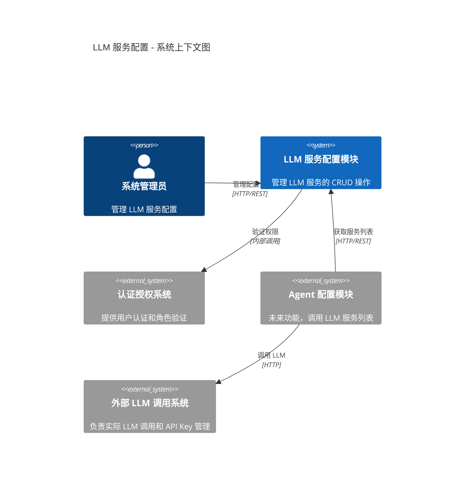
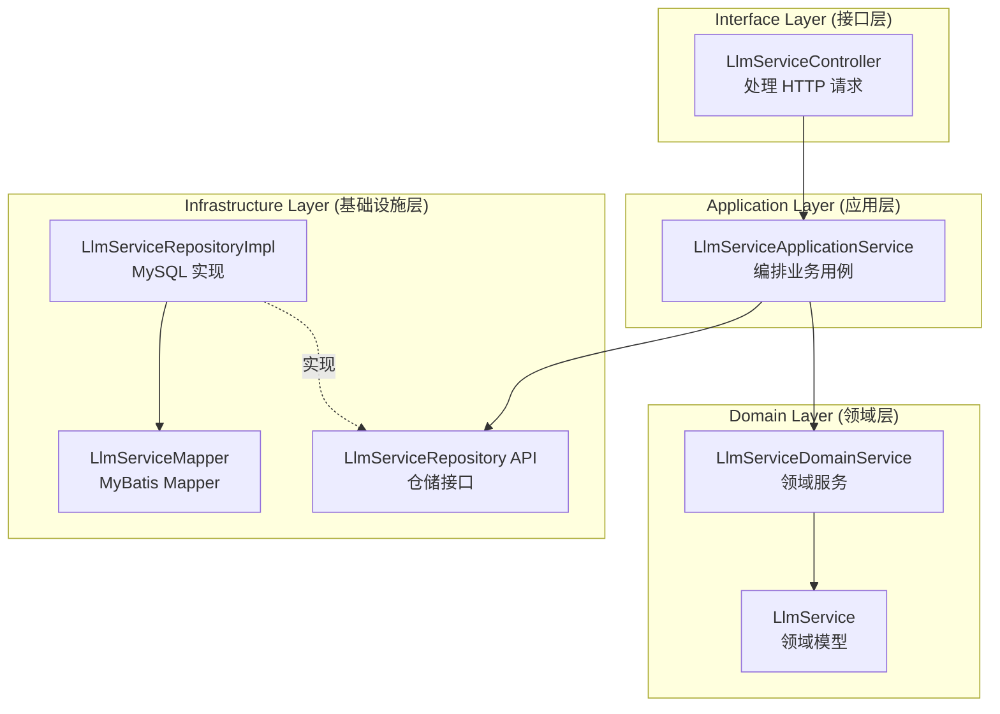
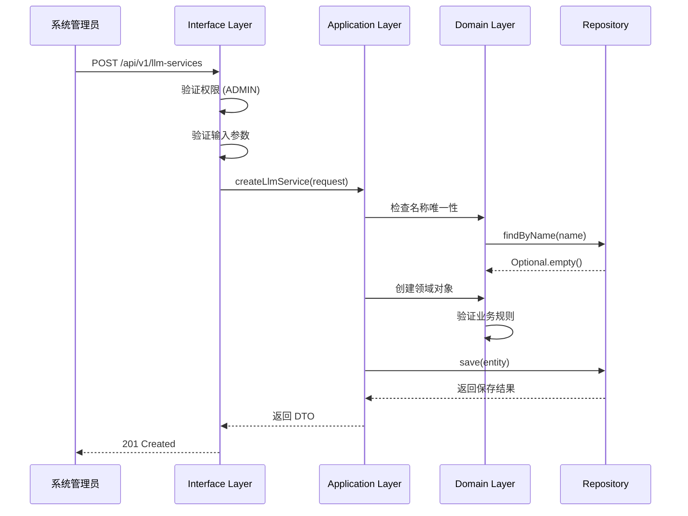
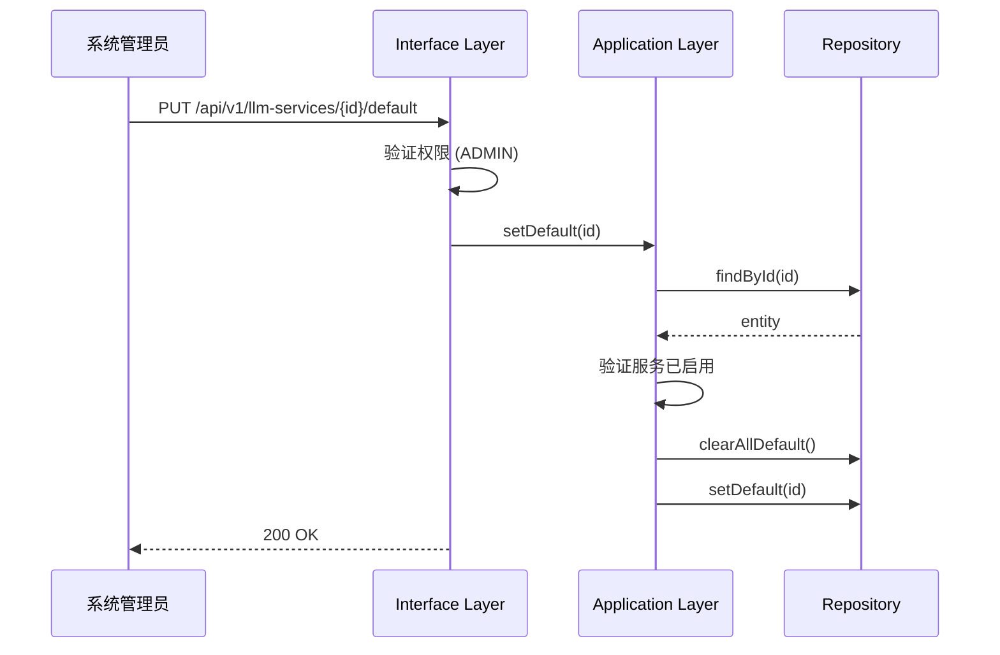
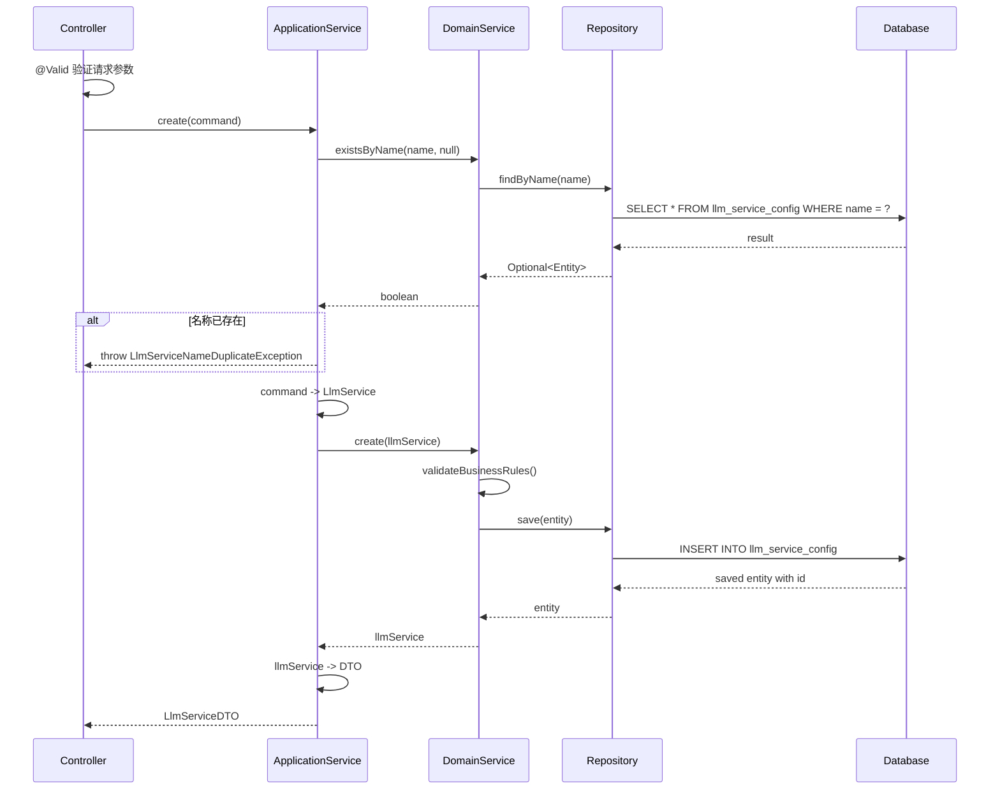

# LLM 服务配置 设计文档

## 1. 概述

### 1.1 项目背景和设计目标

本功能为 AIOps 系统提供 LLM 服务配置管理能力，使系统管理员能够管理可用的 LLM 服务列表（如 OpenAI、Claude、本地模型），供 Agent 配置时选择使用。

**设计目标**:
- 提供简洁的 LLM 服务 CRUD 管理功能
- 支持多种 LLM 供应商类型
- 支持服务优先级和默认服务设置
- 遵循项目 DDD 分层架构规范

### 1.2 设计范围和边界

**系统内部**（本功能实现）:
- LLM 服务配置管理（创建、查询、更新、删除）
- 服务状态管理（启用/禁用）
- 默认服务和优先级管理

**系统外部**（本功能不涉及）:
- API Key 存储和管理（由外部系统负责）
- 实际 LLM 调用（由外部系统负责）
- 调用统计和成本控制（由外部系统负责）
- 用户认证和角色管理（已有系统功能）

### 1.3 关键约束和假设

**约束**:
- 遵循项目宪法定义的 DDD 分层架构
- 使用 Spring Boot 3.4.1 + MyBatis-Plus 3.5.7 + MySQL 技术栈
- 所有条件查询必须在 Mapper XML 中实现

**假设**:
- 系统已有基础的用户角色管理功能
- Agent 配置功能尚未实现，本功能提供 API 供未来调用

---

## 2. 高层设计

### 2.1 静态结构

#### 2.1.1 系统边界



#### 2.1.2 架构模式和模块划分

采用 **DDD 分层架构**（遵循项目宪法）：



**模块职责**:

| 模块 | 层次 | 职责 |
|------|------|------|
| LlmServiceController | Interface | 处理 HTTP 请求，输入验证，权限检查 |
| LlmServiceApplicationService | Application | 编排业务用例，协调领域服务，DTO 转换 |
| LlmService | Domain | 领域模型，封装业务属性和行为 |
| LlmServiceDomainService | Domain | 领域服务，处理跨实体业务逻辑 |
| LlmServiceRepository | Infrastructure API | 仓储接口定义 |
| LlmServiceRepositoryImpl | Infrastructure Impl | MySQL 持久化实现 |

#### 2.1.3 技术栈选择

| 技术领域 | 选择 | 版本 | 说明 |
|----------|------|------|------|
| 语言 | Java | 21 (LTS) | 项目宪法要求 |
| 框架 | Spring Boot | 3.4.1 | 项目宪法要求 |
| ORM | MyBatis-Plus | 3.5.7 | 项目宪法要求 |
| 数据库 | MySQL | 8.0+ | 项目已有基础设施 |
| 构建工具 | Maven | 3.9+ | 项目已有配置 |

#### 2.1.4 接口协议

- **外部接口**: RESTful HTTP API
- **数据格式**: JSON
- **认证方式**: 复用现有认证机制，要求 ADMIN 角色

### 2.2 动态行为

#### 2.2.1 关键业务流程

**流程 1: 添加 LLM 服务**



**流程 2: 设置默认服务**



### 2.3 辅助设计

#### 2.3.1 性能策略

- **查询优化**: LLM 服务列表数据量小（< 10 条），无需缓存
- **响应时间目标**: < 100ms（简单 CRUD 操作）

#### 2.3.2 安全策略

- **权限控制**: 所有管理接口需要 ADMIN 角色
- **数据安全**: 不存储敏感信息（API Key 由外部系统管理）
- **输入验证**: 所有输入参数在接口层验证

#### 2.3.3 可观测性策略

- **日志**: 记录所有配置变更操作（INFO 级别）
- **监控**: 复用现有 Actuator 端点
- **错误追踪**: 使用统一异常处理，包含 traceId

---

## 3. 详细设计

### 3.1 静态结构

#### 3.1.1 接口定义

**API 端点列表**

| 方法 | 路径 | 描述 | 权限 |
|------|------|------|------|
| GET | /api/v1/llm-services | 获取服务列表 | ADMIN |
| POST | /api/v1/llm-services | 创建服务 | ADMIN |
| GET | /api/v1/llm-services/{id} | 获取服务详情 | ADMIN |
| PUT | /api/v1/llm-services/{id} | 更新服务 | ADMIN |
| DELETE | /api/v1/llm-services/{id} | 删除服务 | ADMIN |
| PUT | /api/v1/llm-services/{id}/status | 更新状态 | ADMIN |
| PUT | /api/v1/llm-services/{id}/default | 设置默认 | ADMIN |

**OpenAPI 规范**: 见 `contracts/llm-service-api.yaml`

#### 3.1.2 数据结构设计

**实体属性表**

| 实体 | 属性 | 类型 | 必填 | 描述 | 约束 |
|------|------|------|------|------|------|
| LlmServiceConfig | id | Long | 是 | 服务 ID | 主键，自增 |
| LlmServiceConfig | name | String | 是 | 服务名称 | 唯一，1-100 字符 |
| LlmServiceConfig | description | String | 否 | 服务描述 | 最长 500 字符 |
| LlmServiceConfig | providerType | ProviderType | 是 | 供应商类型 | 枚举值 |
| LlmServiceConfig | endpoint | String | 否 | API 端点 | URL 格式 |
| LlmServiceConfig | modelParameters | JSON | 是 | 模型参数 | JSON 对象 |
| LlmServiceConfig | priority | Integer | 是 | 优先级 | 1-999，默认 100 |
| LlmServiceConfig | enabled | Boolean | 是 | 是否启用 | 默认 true |
| LlmServiceConfig | isDefault | Boolean | 是 | 是否默认 | 默认 false |
| LlmServiceConfig | createdAt | DateTime | 是 | 创建时间 | 自动生成 |
| LlmServiceConfig | updatedAt | DateTime | 是 | 更新时间 | 自动更新 |

**枚举定义**

| 枚举类型 | 值 | 描述 |
|----------|-----|------|
| ProviderType | OPENAI | OpenAI 服务 |
| ProviderType | CLAUDE | Anthropic Claude 服务 |
| ProviderType | LOCAL | 本地部署模型 |
| ProviderType | CUSTOM | 自定义供应商 |

**模型参数结构 (ModelParameters)**

| 属性 | 类型 | 必填 | 默认值 | 约束 | 描述 |
|------|------|------|--------|------|------|
| modelName | String | 是 | - | - | 模型名称 |
| temperature | Double | 否 | 1.0 | 0-2 | 温度参数 |
| maxTokens | Integer | 否 | 4096 | 1-128000 | 最大 Token 数 |
| topP | Double | 否 | 1.0 | 0-1 | Top-P 参数 |
| frequencyPenalty | Double | 否 | 0 | -2 到 2 | 频率惩罚 |
| presencePenalty | Double | 否 | 0 | -2 到 2 | 存在惩罚 |

#### 3.1.3 核心方法定义

**领域服务接口**

```java
public interface LlmServiceDomainService {
    LlmService create(LlmService llmService);
    LlmService update(Long id, LlmService llmService);
    void delete(Long id, boolean force);
    void updateStatus(Long id, boolean enabled);
    void setDefault(Long id);
    boolean existsByName(String name, Long excludeId);
}
```

**应用服务接口**

```java
public interface LlmServiceApplicationService {
    List<LlmServiceDTO> list(boolean enabledOnly);
    LlmServiceDTO getById(Long id);
    LlmServiceDTO create(CreateLlmServiceCommand command);
    LlmServiceDTO update(Long id, UpdateLlmServiceCommand command);
    void delete(Long id, boolean force);
    void updateStatus(Long id, boolean enabled);
    void setDefault(Long id);
}
```

**仓储接口**

```java
public interface LlmServiceRepository {
    Optional<LlmServiceEntity> findById(Long id);
    List<LlmServiceEntity> findAll();
    List<LlmServiceEntity> findByEnabled(boolean enabled);
    LlmServiceEntity save(LlmServiceEntity entity);
    void deleteById(Long id);
    Optional<LlmServiceEntity> findByName(String name);
    void clearAllDefault();
    void setDefault(Long id);
}
```

### 3.2 动态行为

#### 3.2.1 详细业务流程

**创建 LLM 服务流程**



#### 3.2.2 状态转换

**LLM 服务状态转换表**

| 当前状态 | 触发事件 | 条件 | 目标状态 | 副作用 |
|----------|----------|------|----------|--------|
| 已启用 | disable() | 非唯一默认服务 | 已禁用 | 无 |
| 已启用 | disable() | 是唯一默认服务 | - | 抛出 CannotDisableException |
| 已禁用 | enable() | - | 已启用 | 无 |
| 任意 | setDefault() | 服务已启用 | 已启用+默认 | 清除其他默认标记 |
| 任意 | setDefault() | 服务已禁用 | - | 抛出 MustEnabledException |
| 任意 | delete() | 无引用或 force=true | 已删除 | 物理删除 |
| 任意 | delete() | 有引用且 force=false | - | 抛出 ServiceInUseException |

### 3.3 辅助设计

#### 3.3.1 错误处理

**错误码定义**

| 错误码 | HTTP 状态码 | 描述 |
|--------|-------------|------|
| LLM_SERVICE_NOT_FOUND | 404 | LLM 服务不存在 |
| LLM_SERVICE_NAME_DUPLICATE | 409 | 服务名称已存在 |
| LLM_SERVICE_IN_USE | 409 | 服务被 Agent 引用 |
| LLM_SERVICE_CANNOT_DISABLE | 400 | 无法禁用唯一默认服务 |
| LLM_SERVICE_MUST_ENABLED | 400 | 只能将启用的服务设为默认 |
| LLM_SERVICE_INVALID_PARAMS | 400 | 模型参数无效 |

#### 3.3.2 日志设计

| 操作 | 日志级别 | 格式 |
|------|----------|------|
| 创建服务 | INFO | [LLM] 创建服务: id={}, name={}, provider={} |
| 更新服务 | INFO | [LLM] 更新服务: id={}, changes={} |
| 删除服务 | WARN | [LLM] 删除服务: id={}, force={} |
| 状态变更 | INFO | [LLM] 服务状态变更: id={}, enabled={} |
| 设置默认 | INFO | [LLM] 设置默认服务: id={} |

---

## 4. 架构决策记录 (ADR)

### ADR-001: 遵循现有技术栈

- **状态**: 已接受
- **背景**: 项目宪法已定义技术栈要求
- **决策**: 使用 Spring Boot 3.4.1 + MyBatis-Plus 3.5.7 + MySQL
- **理由**: 保持项目一致性，降低维护成本
- **后果**:
  - 正面：无额外学习成本，复用现有基础设施
  - 负面：无

### ADR-002: 模型参数存储为 JSON

- **状态**: 已接受
- **背景**: 不同 LLM 供应商的模型参数可能不同，需要灵活的存储方式
- **决策**: 将 modelParameters 存储为 JSON 字段
- **理由**:
  - 便于扩展新的参数字段
  - 不同供应商可以有不同的参数结构
  - MySQL 8.0+ 原生支持 JSON 类型
- **后果**:
  - 正面：扩展性好，无需修改表结构
  - 负面：无法对 JSON 内部字段建立索引（但本场景不需要）

### ADR-003: 不实现缓存

- **状态**: 已接受
- **背景**: 是否需要对 LLM 服务列表进行缓存
- **决策**: 不实现缓存，直接查询数据库
- **理由**:
  - 数据量极小（最多 10 条）
  - 访问频率低（仅管理员操作和 Agent 配置时）
  - 实现缓存增加复杂度（缓存失效、一致性）
- **后果**:
  - 正面：实现简单，无缓存一致性问题
  - 负面：无（数据量小，性能不是瓶颈）

---

## 5. 风险和缓解措施

### 5.1 技术风险

| 风险 | 可能性 | 影响 | 缓解措施 |
|------|--------|------|----------|
| JSON 字段兼容性 | 低 | 中 | MySQL 8.0+ 原生支持，无风险 |
| 与 Agent 模块集成 | 中 | 低 | 预留清晰的 API 接口，文档完善 |

### 5.2 依赖风险

| 风险 | 可能性 | 影响 | 缓解措施 |
|------|--------|------|----------|
| 权限系统不可用 | 低 | 高 | 降级为允许访问，记录日志告警 |

### 5.3 性能风险

无显著性能风险。数据量小，操作简单，无性能瓶颈。
